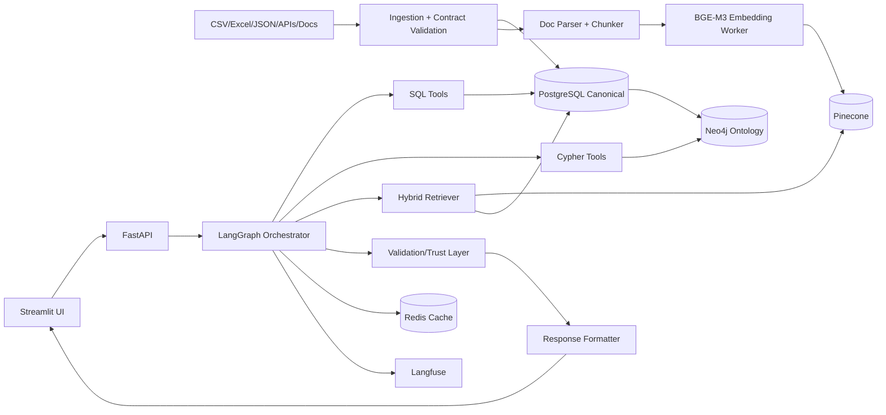
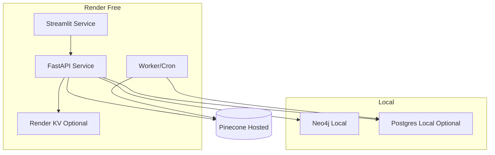

# NBFC Enterprise Decision Platform Blueprint (Local-First + Hybrid Cloud)

## SECTION A — SYSTEM VISION
### What the platform is
An ontology-driven enterprise decision platform for NBFC operations intelligence that combines deterministic analytics, graph reasoning, multi-mode retrieval, and governed LLM synthesis.

### What problem it solves
- Breaks silos between reports, raw data, policy docs, and operational workflows.
- Answers "why" and "what changed" questions with grounded evidence.
- Supports managers and analysts with explainable recommendations, not just generated text.

### Why this is a strong local Palantir-like mimic
- Unifies ingestion, ontology, tooling, workflow orchestration, and decision support in one operating model.
- Uses typed contracts, lineage, policy applicability, and auditability as first-class concepts.
- Keeps numeric truth deterministic while using LLMs for reasoning and communication.

### What it is NOT
- Not a generic chatbot wrapper over PDFs.
- Not an autonomous agent that makes uncontrolled production decisions.
- Not a cloud-heavy architecture requiring expensive managed services.

---

## SECTION B — CORE CAPABILITIES
| Capability | Design | Why this choice | Trade-off |
|---|---|---|---|
| Ingestion | Batch + incremental pipelines for CSV/Excel/JSON/mock APIs | Works with realistic enterprise source diversity | More connector logic to maintain |
| Normalization | Staging -> canonical models in PostgreSQL | Deterministic KPI computation and schema control | Requires data contract discipline |
| Ontology sync | Neo4j upsert jobs from canonical tables + lineage metadata | Explicit relationships for impact analysis and routing | Extra sync layer to operate |
| Document indexing | Parse, chunk, embed, metadata-tag, push to Pinecone | Grounded policy/process retrieval | Requires careful chunk/version handling |
| Semantic search | BGE-M3 embeddings + Pinecone | Strong multilingual and granular matching | Vector relevance can drift |
| Graph traversal | Cypher tools for lineage/applicability | Faster multi-hop relationship reasoning | Graph modeling overhead |
| KPI tools | SQL-backed deterministic tools | Prevents invented business numbers | Less flexibility than free-form LLM output |
| Workflow orchestration | LangGraph node graph with typed state | Purposeful branching and retries | More orchestration code |
| Memory | Layered enterprise memory (session/workflow/validated insight) | Useful continuity without chat bloat | Conflict/staleness management |
| Caching | Multi-layer cache with safety classes | Cost + latency control | Invalidation complexity |
| Observability | Langfuse traces + metrics + eval harness | Reproducibility and regression visibility | Instrumentation overhead |
| Validation | Numeric/citation/freshness/auth checks before answer | Trust and governance | Slight latency increase |
| Governance | RBAC, audit events, prompt/version control | Enterprise defensibility | Role model and policy administration |
| User experience | Advanced Streamlit control tower + FastAPI backend | Fast portfolio delivery with rich interactions | Less frontend freedom than React |

---

## SECTION C — HIGH-LEVEL ARCHITECTURE
### Components
1. Source systems: CSV, Excel, JSON feeds, mock internal APIs, policy documents.
2. Ingestion services: parsers, validators, contract checker, staging loader.
3. Canonical storage: PostgreSQL (facts, dimensions, metric definitions, governance metadata).
4. Ontology layer: Neo4j graph for lineage, dependencies, ownership, policy applicability.
5. Retrieval layer: hybrid retriever (vector + BM25 + metadata + graph expansion + schema hints).
6. Vector layer: Pinecone Starter index with strict namespace and metadata strategy.
7. Tool layer: deterministic SQL/Cypher/document/tools with typed I/O contracts.
8. Cache layer: Redis primary; Postgres fallback cache tables; in-process LRU for hot ephemeral keys.
9. Agent orchestration: LangGraph request router, planner, execution, verification, formatting nodes.
10. Validation layer: numeric grounding, citation coverage, freshness checks, auth checks.
11. Observability: Langfuse traces/spans/prompts/evals + Prometheus/Grafana optional.
12. API/UI: FastAPI for platform API; Streamlit for analyst cockpit and operations dashboards.

### End-to-end data flow
1. Ingestion job reads source file/API payload and validates against data contract.
2. Valid records load into staging, then normalized canonical tables in PostgreSQL.
3. Ontology sync creates/updates Neo4j nodes/edges and lineage links.
4. Document parser creates chunks, metadata, embedding tasks.
5. Embedding worker generates BGE-M3 vectors with embedding cache dedupe.
6. Pinecone upsert writes vectors by namespace and document version.
7. User query hits FastAPI endpoint and enters LangGraph orchestration.
8. Router picks query class and execution path; cache lookup first.
9. Tools/retrievers run; verifier checks grounding, freshness, and citations.
10. Response formatter returns grounded output with evidence and confidence.

### Local vs cloud boundaries (default)
| Layer | Full Local | Hybrid Free-Cloud Default | Governance Note |
|---|---|---|---|
| UI | Streamlit local | Streamlit on Render web service | Keep local for sensitive demos |
| API | FastAPI local | FastAPI on Render web service | Enforce token + RBAC |
| Postgres | Docker local | Local or low-cost hosted Postgres | Prefer local for PII |
| Neo4j | Docker local | Local (default), optional hosted for demo | Keep local for governance-heavy workloads |
| Pinecone | Hosted | Hosted | External dependency accepted |
| Cache | Redis local | Render KV or hosted Redis + in-process fallback | Session cache sensitivity policy required |
| Langfuse | Local compose | Local/self-hosted or cloud endpoint | Scrub PII in traces |
| Workers | Local background | Render worker/web cron | Cold start mitigation needed |

---

## SECTION D — DATA MODEL (PostgreSQL Conceptual Schema)
### Core tables
- `datasets(id, name, owner_team, source_type, contract_version, pii_classification, active)`
- `dataset_versions(id, dataset_id, version, schema_hash, row_count, checksum, effective_from, effective_to, status)`
- `ingestion_runs(id, dataset_id, run_type, started_at, ended_at, status, error_summary, source_uri, replay_of_run_id)`
- `documents(id, doc_type, title, source_uri, version, effective_date, expiry_date, owner_team, hash, status)`
- `chunks(id, document_id, parent_chunk_id, chunk_index, text, token_count, embedding_model, embedding_hash, version)`
- `chunk_metadata(chunk_id, region, product, language, policy_type, effective_date, supersedes_doc_id, tags jsonb)`
- `metrics(id, metric_name, period, value_numeric, unit, dimensions jsonb, computed_at, dataset_version_id)`
- `metric_definitions(id, metric_name, sql_template, owner_team, refresh_sla_hours, criticality, approval_required)`
- `business_rules(id, rule_code, rule_text, rule_type, applies_to jsonb, priority, active_from, active_to)`
- `workflows(id, workflow_type, entity_type, entity_id, state, assignee_team, due_date, sla_status)`
- `users(id, email, display_name, status, created_at)`
- `roles(id, role_name, scope_type, scope_value)`
- `permissions(id, role_id, resource, action, conditions jsonb)`
- `sessions(id, user_id, channel, started_at, last_activity_at, context_hash, status)`
- `memory_items(id, memory_type, user_id, entity_ref, content, confidence, source_refs jsonb, expires_at, status)`
- `cache_registry(id, cache_key, cache_type, scope, created_at, expires_at, invalidation_token, safety_class)`
- `audit_events(id, actor_id, action, resource_type, resource_id, payload jsonb, trace_id, created_at)`
- `prompt_versions(id, prompt_name, version, template, change_reason, active, created_at)`
- `eval_runs(id, suite_name, model_version, prompt_version, started_at, ended_at, score_summary jsonb)`
- `feedback(id, session_id, user_id, response_id, rating, comment, tags jsonb, created_at)`

### Storage responsibility
- PostgreSQL: transactional truth, contracts, KPIs, governance, audit, memory metadata, prompt/eval records.
- Neo4j: relationships requiring variable-depth traversal and impact propagation.
- Pinecone: chunk vectors + minimal retrieval metadata for semantic recall.
- Cache layer: short-lived computed artifacts (embeddings, retrieval results, tool outputs, session context).

---

## SECTION E — ONTOLOGY / GRAPH MODEL (Neo4j)
### Node labels
`Customer, Loan, Payment, Account, Collector, Campaign, Region, Branch, Product, Metric, Report, Dataset, Document, Policy, Rule, Workflow, Task, Exception, Owner, Team`

### Relationship types
`CUSTOMER_HAS_LOAN, LOAN_HAS_PAYMENT, ACCOUNT_IN_REGION, METRIC_DEPENDS_ON, REPORT_USES_METRIC, REPORT_USES_DATASET, DOCUMENT_GOVERNS_WORKFLOW, RULE_APPLIES_TO_PRODUCT, TASK_ASSIGNED_TO_TEAM, EXCEPTION_BLOCKED_BY_RULE, DATASET_REFRESHED_BY_JOB, POLICY_REFERENCED_BY_DOCUMENT, METRIC_OWNED_BY_TEAM`

### Why graph vs SQL by query class
| Query class | Prefer graph | Prefer SQL |
|---|---|---|
| Multi-hop lineage (`report -> metric -> dataset -> source`) | Natural variable-depth traversal | SQL recursive CTE is harder to maintain |
| Impact analysis after dataset delay | Fast dependency neighborhood expansion | SQL joins become brittle with depth |
| Policy applicability across product+region+workflow | Relationship filters and path proofs | SQL can do fixed joins only |
| Ownership/escalation chain resolution | Team/owner path traversal | SQL only if hierarchy is shallow and static |
| Numeric KPI values and period comparisons | No | Yes, deterministic aggregates |
| Bulk tabular reporting | No | Yes, optimized relational analytics |

---

## SECTION F — ADVANCED RAG DESIGN (14 Patterns)
| Pattern | Problem solved | When to use | Indexing / namespace strategy | Retrieval flow | Trade-offs | Failure mode | Mitigation |
|---|---|---|---|---|---|---|---|
| 1. Basic semantic RAG | Semantic mismatch in keyword search | General policy/process Q&A | `docs_current` namespace; dense chunks | Embed query -> Pinecone top-k -> synthesize | Fast, simple | Misses exact clause language | Add BM25 fusion |
| 2. Metadata-filtered RAG | Wrong domain retrieval | Product/region/time constrained asks | Metadata tags: `product, region, effective_date` | Filter first, then vector search | Higher precision | Over-filter empty result | Backoff filter strategy |
| 3. Parent-child chunking | Loss of context in small chunks | Long SOP/policy docs | Child vectors + parent text in Postgres | Retrieve child -> expand parent | Better context quality | Parent bloat in prompt | Token budget truncation |
| 4. Multi-hop RAG | Single retrieval pass misses dependency | Why/lineage questions | Graph keys in metadata | First retrieval -> entity extract -> second retrieval | Better reasoning | Latency increase | Cache hop results |
| 5. Graph RAG | Need structural grounding | Applicability/lineage/ownership questions | Node IDs in chunk metadata | Cypher expansion -> doc/vector fetch | Strong explainability | Graph staleness | Sync SLA + freshness check |
| 6. Hybrid BM25 + vector | Dense misses exact terms | Policy clauses, codes, table names | BM25 index in Postgres/Elastic-lite + Pinecone | Parallel retrieval -> reciprocal rank fusion | Recall + precision | Score normalization issues | Calibrate fusion weights |
| 7. Schema-aware retrieval | LLM cannot find table/column semantics | KPI/data definition questions | Schema docs embedded in `schema` namespace | Retrieve schema + metric definitions + SQL tool | Better tool planning | Outdated schema docs | Contract-driven refresh |
| 8. Tool-augmented RAG | Docs alone lack numeric truth | KPI/exceptions analysis | Tool outputs cached and cited | Tools first for numbers -> retrieval for context | Trustworthy outputs | Tool timeout | Degraded textual response with warning |
| 9. Citation-enforced RAG | Unsupported claims | All compliance-sensitive responses | Chunk IDs mandatory in context | Generate draft -> citation checker -> repair | Better trust | Over-constrained output | Partial answer mode |
| 10. Temporal RAG | Outdated policy confusion | Time-bound rules and monthly analysis | `effective_from/to` and `doc_version` metadata | Time filter + version-aware retrieve | Correct historical answers | Missing effective dates | Reject + request valid timeframe |
| 11. Contradiction-aware RAG | Conflicting docs/rules | Policy conflicts | Store supersession links and contradiction tags | Retrieve diverse sources -> contradiction detector -> reconcile | Higher reliability | False conflict detection | Human escalation threshold |
| 12. Memory-aware RAG | Repeated context gathering | Ongoing investigation sessions | Memory namespace with confidence tags | Retrieve session/workflow memory + fresh context | Faster continuity | Stale memory reuse | Freshness and confidence gating |
| 13. Tabular RAG | LLM poor on structured aggregates | KPI tables and branch comparisons | Table summaries + schema vectors | SQL compute -> retrieve relevant notes -> synthesize | Numeric + narrative blend | Table snapshot mismatch | Dataset version pinning |
| 14. Agentic retrieval repair loops | First pass misses evidence | Low-confidence or failed citation checks | Retry state tracked in graph state | Detect failure -> reformulate query -> rerun retrieval | Higher answer robustness | Latency tax | Max retry cap + degrade |

---

## SECTION G — EMBEDDING + VECTOR DESIGN (BGE-M3 + Pinecone Starter)
### Why BGE-M3
- Strong multilingual support for NBFC document mixes.
- Handles short/long text reasonably with multi-granularity behavior.
- 1024-dimensional vectors are compatible with practical Pinecone setups.

### Chunking approach
- Policy/process docs: 350-550 tokens child chunks with 15-20% overlap.
- Parent chunks: section-level 1,200-1,800 tokens stored in Postgres/object storage.
- Tables/text hybrids: keep heading + row context together to preserve semantics.

### Embedding generation flow
1. Parse document into sections and normalized text.
2. Compute canonical text hash; check embedding cache by `(model, text_hash)`.
3. If miss, generate BGE-M3 embedding and store in embedding cache.
4. Upsert vector + metadata into Pinecone.
5. Record mapping in `chunks`/`chunk_metadata` with `embedding_hash`.

### Pinecone index design
- Single index: `nbfc-main-1024` (cosine metric), to stay free-tier efficient.
- Namespaces:
  - `docs_current`
  - `docs_archive`
  - `schema`
  - `memory_validated`
  - `playbook`
- Metadata fields:
  - `chunk_id, document_id, document_version, source_type, region, product, policy_type, language, effective_from, effective_to, pii_class, dataset_version, owner_team, supersedes, confidence_tag`

### Upsert/update/delete strategy
- Upsert key: stable `chunk_id:version`.
- Update: write new version as new vector; mark old as archived via metadata + move namespace.
- Delete: hard delete only for legal removal requests; otherwise soft archive.
- Re-embedding triggers: model change, chunk text hash change, chunking policy change.
- Avoid re-embedding when only metadata changes.

### Free-tier efficiency tactics
- Keep one index and limited namespaces.
- Prefer metadata filters to reduce top-k and token usage.
- Store only retrieval-critical metadata in Pinecone; keep heavy attributes in Postgres.
- Use TTL/retention for stale memory vectors.
- Batch upserts and nightly compaction for archived vectors.

### Reranker pairing
- Recommended reranker: `bge-reranker-v2-m3` (or equivalent cross-encoder) for high-stakes policy/legal-style questions.
- Enable reranker selectively:
  - when query class is policy/compliance,
  - when first-pass confidence is low,
  - when contradiction detector flags conflict.
- Skip reranking under latency pressure for low-risk exploratory asks.

---

## SECTION H — AGENT ARCHITECTURE (LangGraph)
### Node graph
1. `cache_lookup_node`
2. `request_classifier_router`
3. `retrieval_planner`
4. `policy_guard_node`
5. `sql_tool_node`
6. `ontology_traversal_node`
7. `document_retrieval_node` (BM25/schema/docstore)
8. `pinecone_retrieval_node`
9. `memory_retrieval_node`
10. `synthesis_node`
11. `verifier_node`
12. `citation_checker_node`
13. `fallback_retry_node`
14. `response_formatter_node`

### State passed between nodes (`LangGraphState`)
- `query_id, user_id, role_scope, session_id`
- `query_text, query_class, route_label, intent_confidence`
- `entities, time_window, filters`
- `tool_plan, retrieval_plan, executed_steps`
- `tool_results, graph_results, retrieval_hits, chunk_ids`
- `citations, numeric_claims, validation_flags, freshness_flags`
- `retry_count, fallback_mode, latency_budget_ms`
- `final_answer, confidence_score, audit_refs`

### Deterministic vs LLM-driven
- Deterministic: routing rules fallback, SQL tools, Cypher tools, validation checks, citation coverage tests.
- LLM-driven: synthesis and limited plan refinement.
- Hybrid: retrieval planning starts rule-based, can be refined by LLM only within guardrails.

### Branching and retry rules
- Branch on query class (`kpi_numeric`, `policy_lookup`, `lineage_trace`, `exception_action`, `comparison_analysis`, `change_detection`).
- Retry only when citation check fails, unsupported claim detected, or low confidence with available extra context.
- Hard stop after max 2 repair loops or latency budget breach.

### Patterns included
- Planner-executor: planner selects tools and retrieval modes; executor runs deterministic steps.
- ReAct-style tool use: controlled action-observation loops in execution nodes.
- Self-correction: verifier + citation checker drive bounded retries.
- Human escalation: unresolved contradictions, auth-restricted asks, or missing critical datasets.
- Safe failure: partial answer with explicit missing evidence and next action.

---

## SECTION I — TOOLING CONTRACTS
| Tool | Input schema (summary) | Output schema (summary) | Source of truth | Latency target | Failure modes | Cache potential | Observability fields |
|---|---|---|---|---|---|---|---|
| `get_kpi` | `metric_name, period, filters` | `value, unit, dataset_version, computed_at` | PostgreSQL | <300 ms | metric missing, stale dataset | High (period+filters) | metric, period, dataset_version, ttl |
| `compare_kpi` | `metric_name, period_a, period_b, filters` | `value_a, value_b, delta, pct_delta` | PostgreSQL | <450 ms | period missing | High | periods, delta_sign |
| `trace_metric_lineage` | `metric_name` | graph path list + dataset refs | Neo4j + Postgres | <500 ms | broken lineage | Medium | hop_count, missing_nodes |
| `get_policy` | `policy_id_or_name, as_of_date` | policy text + version + effective range | Postgres/docstore | <400 ms | ambiguity | High with as_of_date | policy_version |
| `search_documents` | `query, filters, top_k` | doc/chunk list + scores | BM25/doc index | <350 ms | zero hits | Medium | top_k, hit_count |
| `pinecone_semantic_search` | `query, filters, top_k, namespace` | vector hits + metadata | Pinecone | <450 ms warm | timeout/throttle | High | namespace, score_dist |
| `graph_expand` | `entity_id, relation_types, depth` | neighbor nodes + edges | Neo4j | <500 ms | depth explosion | Medium | depth, node_count |
| `check_dataset_freshness` | `dataset_name` | freshness status + lag | Postgres | <200 ms | dataset missing | High | lag_minutes |
| `explain_exception` | `exception_id` | exception context + blockers + owner | Postgres + Neo4j | <600 ms | unresolved refs | Medium | blocker_count |
| `get_customer_summary` | `customer_id` | profile + loans + status | Postgres | <350 ms | auth denied | Medium | redactions |
| `list_open_tasks` | `entity_id` | task list + SLA | Postgres/Neo4j | <350 ms | stale tasks | High | overdue_count |
| `suggest_next_best_action` | `entity_or_case_id` | ranked actions + rationale + evidence | Rule engine + tools + retrieval | <900 ms | missing evidence | Low-Medium | rule_hits, confidence |

---

## SECTION J — CACHING DESIGN
### Recommended default architecture
- Local: Redis primary + in-process LRU (small hot cache) + Postgres cache registry/audit.
- Hybrid free-cloud: Render KV/hosted Redis for shared runtime cache; in-process fallback.

| Cache layer | Key design | TTL | Invalidation | Safe when | Dangerous when | Risk control |
|---|---|---|---|---|---|---|
| Embedding cache | `emb:{model}:{text_hash}` | 30-90 days | model/version change | same text/model | model drift ignored | include model+chunk policy version |
| Retrieval result cache | `ret:{route}:{query_hash}:{filters_hash}:{index_ver}` | 5-30 min | source update token | exploratory queries | fast-changing corpora | freshness token check |
| Semantic response cache | `ans:{query_hash}:{role}:{data_cut}` | 2-10 min | data_cut bump, prompt version change | non-critical summaries | numeric asks without recompute | prohibit for critical KPI classes |
| SQL/tool cache | `tool:{name}:{args_hash}:{dataset_ver}` | 5-60 min | dataset version change | period-bound metrics | near-real-time ops | include dataset version pin |
| Graph traversal cache | `graph:{entity}:{rels}:{depth}:{graph_ver}` | 10-30 min | ontology sync completion | stable hierarchy | active workflow routing changes | graph version token |
| Session cache | `sess:{session_id}` | sliding 30 min | logout/revoke | conversational continuity | role changes mid-session | session role checksum |
| Prompt compilation cache | `prompt:{name}:{version}:{param_hash}` | 1-7 days | prompt version change | stable templates | policy text changes inside template | strict prompt versioning |
| Document parse cache | `parse:{doc_hash}:{parser_ver}` | 30-180 days | parser version change | immutable docs | OCR/parsing bug discovered | parser version field |

---

## SECTION K — MEMORY DESIGN
### Memory layers
1. Session memory: active conversation context, short-lived.
2. User preference memory: preferred report format, branch default filters.
3. Workflow memory: case states, recent actions, pending approvals.
4. Validated insight memory: high-confidence findings with evidence refs.
5. Semantic cache memory: previously verified response artifacts.
6. Entity-specific memory: customer/case notes with strict RBAC.
7. Correction memory: known wrong assumptions and corrected interpretations.

### What gets stored
- Only validated facts, operator-confirmed preferences, workflow transitions, and evidence-linked insights.

### What does not get stored
- Raw full chat logs by default.
- Sensitive PII in free-text memory without masking.
- Low-confidence speculative reasoning.

### Qualification and decay
- Require confidence threshold + evidence presence for durable memory.
- Decay policies:
  - session: minutes/hours,
  - workflow: until closed + retention window,
  - validated insights: expiry by dataset freshness SLA.

### Conflict handling
- New memory entry with higher confidence supersedes old entry.
- Contradictions create conflict records, not silent overwrite.
- Conflict-sensitive queries force fresh retrieval + tool recompute.

### Privacy and security
- Memory partitioned by tenant/team/role scope.
- PII-tagged memory encrypted at rest and excluded from non-authorized retrieval.
- Audited reads/writes to memory store.

---

## SECTION L — VALIDATION / TRUST LAYER
### Mandatory checks before final answer
1. Numeric fidelity: every numeric claim must map to tool output ID.
2. Answer-to-tool grounding: narrative claims linked to tool/retrieval evidence.
3. Citation coverage: policy/process answers require source chunk IDs.
4. Unsupported claim detection: reject claims with no evidence linkage.
5. Freshness validation: datasets/doc versions checked against SLA.
6. Schema validation: tool response schema must match declared contract.
7. Authorization checks: user role and scope enforced.
8. Confidence scoring: composite score from retrieval/tool/validator signals.
9. Contradiction detection: compare retrieved sources for conflicting statements.

### Refuse vs partial vs escalate
- Refuse:
  - unauthorized request,
  - critical numeric request without deterministic source,
  - unresolved high-severity contradiction in compliance answer.
- Partial answer:
  - non-critical context missing but core evidence present.
- Escalate:
  - policy conflict unresolved,
  - repeated tool failures for critical operational action,
  - potential PII access anomaly.

### Graceful failure pattern
- Return what is known, what is unknown, why it failed, and next deterministic step.

---

## SECTION M — OBSERVABILITY / EVALS
### Langfuse instrumentation
- Capture route label, retrieval mode, tool calls, prompts, model versions, chunk IDs, citations, confidence, and validator outcomes.
- Log full trace lineage across nodes using shared `trace_id` and `query_id`.

### Metrics
- Online:
  - request count by route,
  - p50/p95 latency by node,
  - cache hit rates by layer,
  - citation pass rate,
  - numeric grounding pass rate,
  - fallback rate,
  - user feedback score.
- Offline eval:
  - golden question set by query class,
  - hallucination challenge set,
  - retrieval precision@k,
  - tool correctness test suite,
  - contradiction handling tests.

### Regression design
- Nightly eval runs per prompt/model version.
- Block release on threshold breaches:
  - citation pass < 98% for compliance route,
  - numeric grounding < 100% for KPI route,
  - p95 latency SLA breach beyond tolerance.

---

## SECTION N — GOVERNANCE / SECURITY
- RBAC with role + scope constraints (`team, region, product`).
- Row/role restrictions for sensitive entities (customer/account).
- Immutable audit trails for tool calls, policy checks, and response generation.
- PII tagging in contracts and retrieval filters.
- Prompt/version control with approval workflow for high-impact prompt changes.
- Dataset freshness visibility in UI and API responses.
- Approval workflows for action recommendations (human-in-the-loop).
- Replayability: deterministic re-run by pinning dataset/doc/prompt versions.
- Source traceability: every answer links back to metric run IDs and chunk IDs.

---

## SECTION O — DEPLOYMENT PLAN
### 1) Full local deployment (Docker Compose)
Services:
- `api` (FastAPI)
- `ui` (Streamlit)
- `postgres`
- `neo4j`
- `redis`
- `langfuse-web`
- `langfuse-worker`
- `worker-ingestion`
- `worker-embedding`
- `minio` (optional object store)
- `prometheus` (optional)
- `grafana` (optional)

Startup order:
1. Postgres/Redis/Neo4j/MinIO
2. Langfuse services
3. API and workers
4. UI

Health checks:
- `/healthz` for API/UI/workers,
- DB ping for Postgres/Neo4j/Redis,
- dependency health summary endpoint in API.

### 2) Hybrid free-cloud deployment (default)
- Render static/web for UI (Streamlit container on web service).
- Render web service for FastAPI.
- Render worker (or cron trigger) for ingestion/embedding jobs.
- Pinecone hosted for vectors.
- Postgres local or low-cost hosted (depending demo needs).
- Neo4j stays local by default; expose read-only API facade if needed.

Cold-start implications and controls:
- Warm-up ping schedule.
- Precomputed caches for top demo queries.
- Graceful "warming up" UX with cached fallback summaries.

Secrets and environment separation
- `.env.local`, `.env.demo`, `.env.prod` with strict key scoping.
- Secret manager in hosted env; no secrets in repo.

Backup strategy
- Postgres daily dump + retention.
- Neo4j periodic export.
- Prompt/version/eval snapshots persisted in Postgres.

---

## SECTION P — REPOSITORY STRUCTURE
```text
/apps
  /api                  # FastAPI app, route handlers, dependency injection
  /ui                   # Streamlit dashboards, query workspace, admin views
/services
  /ingestion            # Source connectors, validation, load jobs
  /ontology-sync        # Neo4j upsert and lineage sync
  /retrieval            # Hybrid retrievers, reranking, retrieval policy
  /agents               # LangGraph nodes, state machine, validators
  /workers              # Async jobs (embedding, parse, refresh)
  /evals                # Golden sets, benchmark runners, regression reports
/libs
  /tool-contracts       # Pydantic schemas and tool interface specs
  /prompts              # Prompt templates + version metadata
  /observability        # Langfuse wrappers, trace helpers, metric emitters
  /security             # RBAC checks, policy guards, PII filters
  /caching              # Cache adapters and key builders
/infra
  /docker               # Compose files and container configs
  /sql                  # DDL, migrations, seed data
  /neo4j                # Constraints, index setup, seed cypher
  /monitoring           # Prometheus/Grafana config
/docs
  architecture.md
  plan.md
  runbooks.md
```

---

## SECTION Q — MVP ROADMAP
| Phase | Exact scope | Success criteria | Demo | Risks |
|---|---|---|---|---|
| 1 | Core infra, CSV ingestion, one ontology slice, Pinecone semantic search, 2 tools, simple LangGraph flow, base cache | Can answer policy + one KPI query with citations | "Explain policy" + "current KPI" | Over-scoping UI and connectors |
| 2 | Hybrid retrieval, graph traversal, deterministic KPI compare tools, validation gate, citation enforcement, retrieval cache | Why-analysis with lineage and validated evidence | "Why KPI dropped?" | Graph sync quality issues |
| 3 | Layered memory, advanced RAG modes, repair loops, observability dashboards, eval harness, semantic cache | Better continuity and lower latency with stable trust metrics | Multi-turn investigation flow | Memory staleness/conflicts |
| 4 | Governance hardening, approvals, multi-user controls, advanced workflows, production resiliency | Audit-ready, role-safe, repeatable outputs | Manager approval workflow | Governance complexity and ops burden |

---

## SECTION R — SAMPLE END-TO-END FLOWS
### 1) Why did collections efficiency drop this month?
1. Router classifies as `kpi_root_cause`.
2. Cache lookup for prior similar query.
3. Run `compare_kpi` + `get_kpi` for drivers.
4. Graph traversal `METRIC_DEPENDS_ON` + dataset freshness check.
5. Retrieve related runbooks/policy notes via hybrid retrieval.
6. Verifier checks numeric grounding and citation coverage.
7. Synthesis returns ranked drivers with evidence and confidence.

### 2) Explain foreclosure policy for bike loans
1. Router: `policy_explanation`.
2. Metadata filter `product=bike_loan` + `effective_date`.
3. Pinecone + BM25 retrieval, optional reranker.
4. Citation checker enforces clause-level support.
5. Response includes policy version, effective period, exceptions.

### 3) Trace lineage of KPI
1. Router: `lineage_trace`.
2. Tool `trace_metric_lineage`.
3. Cypher returns `report -> metric -> dataset -> source`.
4. Formatter outputs path and impact nodes.

### 4) Compare branch A vs branch B and explain drivers
1. Router: `comparative_analysis`.
2. SQL tools compute branch KPIs and deltas.
3. Graph checks region/product/workflow dependencies.
4. Retrieval adds contextual operational notes.
5. Verifier confirms all numbers come from tools.

### 5) What changed in policy docs in last 30 days?
1. Router: `temporal_policy_change`.
2. Filter documents by effective/change dates.
3. Retrieve current and previous versions.
4. Diff summarizer generates change set with citations.

### 6) Next best action for overdue account
1. Router: `exception_action`.
2. Gather customer/account context + open tasks + rules.
3. Graph expand for blockers and ownership.
4. Rule engine proposes ranked actions.
5. Guard node checks policy and authorization.
6. Return recommendation + approval requirement.

---

## SECTION S — FAILURE MODES AND TRADE-OFFS
- Strongest when questions combine metrics + policies + lineage.
- Weakness: operational complexity is high for solo development.
- Neo4j overkill when relationships are shallow, fixed-depth, and rarely traversed.
- Vector search fails on exact clause/code matching; hybrid BM25/reranking needed.
- Agent orchestration adds latency tax; avoid unnecessary multi-hop loops.
- Deterministic tools are mandatory for numeric trust and replayability.
- Memory is dangerous when stale or cross-scope leakage occurs.
- Cache can mislead under schema/data drift unless version tokens are embedded.
- Postgres-only mode is viable for early MVP or low-relationship domains.
- Add Redis when concurrent traffic or repeated retrieval/tool calls increase.
- Avoid over-agentization: use direct tool pipelines for simple query classes.
- Free hosting cold starts can break live demos; prewarm and fallback required.
- Observability overhead can be noisy; curate key spans and sampling policy.
- Governance complexity grows with multi-user and PII; enforce minimal privileged paths.
- Pinecone free tier constrains scale and throughput; enforce retention/namespace discipline.
- Free cloud services have limits (RAM, spin-down, egress); design graceful degradation.

---

## SECTION T — INTERVIEW / PORTFOLIO POSITIONING
### One-line positioning
"A local-first, ontology-driven enterprise decision platform that combines deterministic analytics and governed LLM reasoning for NBFC operations."

### 30-second explanation
This platform unifies structured KPI computation, policy document retrieval, and graph-based lineage in one decision stack. FastAPI and LangGraph orchestrate deterministic tools plus multi-mode RAG, while Neo4j handles impact and dependency reasoning. Validation gates enforce numeric grounding and citations before answers are shown. It is deployable locally and in a free-cloud hybrid path for demos.

### 2-minute architecture explanation
Data from CSV/Excel/JSON/mock APIs is validated against contracts, normalized into PostgreSQL, and synced into Neo4j for lineage, ownership, and policy applicability. Documents are parsed, chunked, embedded with BGE-M3, and indexed in Pinecone with strict metadata and namespace controls. Queries enter FastAPI and pass through LangGraph nodes: route classification, retrieval planning, cache lookup, deterministic tools (SQL/Cypher), semantic retrieval, synthesis, and verification. Verification enforces numeric fidelity, citation coverage, freshness, and authorization before response formatting. Langfuse traces all tool and prompt behavior for regression testing and governance. Deployment supports a full local compose stack and a hybrid free-cloud mode using Render + Pinecone.

### Why this is not just a chatbot
- Deterministic tools own business metrics.
- Graph ontology drives multi-hop reasoning and impact analysis.
- Validation and governance are mandatory pre-response gates.
- Observability and evals enable regression-proof operation.

### Why graph + SQL + RAG + agents + caching together
- SQL: authoritative numbers.
- Graph: variable-depth relationships and lineage.
- RAG: policy/process grounding from unstructured docs.
- Agents: controlled orchestration across heterogeneous tools.
- Caching: practical latency and cost control.

### What makes it enterprise-grade
- Typed contracts, RBAC, audit trails, versioned prompts/evals, reproducibility, explicit failure handling.

### What to improve next
- Multi-tenant isolation.
- Policy simulation sandbox.
- SLA-aware autoscaling and stronger CI/CD for eval gates.

---

## SECTION U — ARCHITECTURE DECISION RECORDS
| Component | Decision | Alternatives considered | Why chosen | Downside accepted | Future pivot trigger |
|---|---|---|---|---|---|
| Streamlit | Advanced Streamlit UI | React, Next.js, internal BI | Fastest path for rich demo/control tower without heavy frontend build | Less UI flexibility | Need complex multi-page UX or custom workflows |
| FastAPI | FastAPI as API/control plane | Flask, Django, Node API | Strong typing, async support, tooling ecosystem | More explicit architecture needed | Need polyglot team with Node-first standards |
| PostgreSQL | Canonical relational store | MySQL, DuckDB-only | ACID + strong SQL + JSONB + maturity | More ops than embedded DB | Scale/ops needs favor managed cloud warehouse |
| Neo4j | Dedicated ontology graph | Postgres recursive CTE only | Better variable-depth traversal and explainable paths | Extra data sync layer | Query patterns remain shallow and static |
| Pinecone Starter | Primary vector store | Weaviate, Qdrant, pgvector | Hosted simplicity for hybrid demos | Free-tier throughput/storage limits | Need larger scale or stricter data residency |
| BGE-M3 | Default embedding model | E5, OpenAI embeddings | Multilingual + robust retrieval quality | Hosting/inference management | Quality/latency requires different model |
| LangGraph | Orchestration runtime | Custom orchestrator, plain chains | Explicit stateful graph and retry control | More orchestration code | Flows simplify to linear deterministic pipelines |
| Langfuse | Observability + eval tracing | OpenTelemetry-only, custom logs | LLM-specific traces/evals/prompt versioning | Additional service overhead | Need centralized enterprise observability stack |
| Redis | Primary cache | In-memory only, Postgres cache only | Low-latency shared cache for tools/retrieval/session | Invalidation complexity | Very low traffic or strict persistence-only requirement |
| Render Free Hosting | Hybrid demo hosting | Fly.io, Railway, self-host only | Practical free-tier deployment narrative | Cold starts and resource caps | Need stable low-latency production uptime |

---

## SECTION V — QUERY TAXONOMY AND ROUTING MATRIX
| Query class | Router label | Primary execution path | Retrieval/tool sequence | Validation requirements | Caching opportunities | Latency target |
|---|---|---|---|---|---|---|
| KPI value lookup | `kpi_numeric` | deterministic-first | `get_kpi` -> freshness -> format | numeric grounding 100%, freshness | tool cache high | p50 < 700 ms |
| KPI comparison | `kpi_compare` | deterministic + contextual retrieval | `compare_kpi` -> optional doc retrieval -> synthesis | numeric + citation if narrative claims | tool + response cache | p50 < 1.2 s |
| Root cause analysis | `kpi_root_cause` | mixed graph+sql+retrieval | compare tools -> graph dependencies -> hybrid retrieval -> synthesize | numeric, citation, contradiction checks | retrieval + graph cache | p50 < 2.5 s |
| Policy explanation | `policy_explanation` | retrieval-first with policy guard | metadata retrieval -> rerank -> synthesize | citation coverage, temporal validity | retrieval cache | p50 < 1.8 s |
| Lineage trace | `lineage_trace` | graph-first | `trace_metric_lineage` -> format path | path completeness + freshness | graph cache | p50 < 1.0 s |
| Rule applicability | `rule_applicability` | graph+doc retrieval | graph expansion -> doc/policy retrieval -> synthesis | citation + policy guard | graph + retrieval cache | p50 < 1.8 s |
| Exception triage | `exception_action` | tool + rules + graph | exception tool -> blockers graph -> action suggester | auth, policy, confidence threshold | tool cache medium | p50 < 2.2 s |
| Operational risk summary | `risk_summary` | retrieval + workflow state | list_open_tasks -> risk docs -> synthesize | freshness + citation | response cache short | p50 < 2.0 s |
| Document change tracking | `doc_change` | temporal retrieval + diff | get docs by date -> diff -> summarize | temporal check + citation | diff cache | p50 < 1.8 s |
| Customer case summary | `customer_summary` | deterministic + memory | customer tool -> workflow memory -> policy snippets | auth + PII masking | session/tool cache | p50 < 1.2 s |

---

## SECTION W — LATENCY BUDGET AND PERFORMANCE STRATEGY
### Stage budget (warm vs cold)
| Stage | Warm budget | Cold budget | Notes |
|---|---:|---:|---|
| Routing/classification | 40 ms | 80 ms | Mostly local compute |
| Cache lookup | 20 ms | 50 ms | Network variance in hybrid mode |
| SQL tools | 120 ms | 300 ms | Indexed queries + pooled connections |
| Graph traversal | 150 ms | 350 ms | Depth-limited expansion |
| Pinecone retrieval | 180 ms | 450 ms | Namespace + metadata filters reduce load |
| Reranking (optional) | 120 ms | 280 ms | Only for high-stakes route |
| Synthesis | 350 ms | 900 ms | Model + prompt size dependent |
| Validation | 80 ms | 160 ms | Deterministic checks |
| Formatting | 20 ms | 50 ms | Response packaging |
| **Total target** | **~1.1-1.3 s** | **~2.6-3.6 s** | By route complexity |

### SLO targets
- p50: <= 1.5 s for common routes.
- p95: <= 4.0 s for complex multi-hop routes.

### Degradation strategy under latency pressure
1. Skip reranker first.
2. Reduce top-k retrieval.
3. Disable secondary retrieval hop.
4. Return partial answer with explicit confidence and missing checks.
5. For cold-start timeout, serve last validated cached summary with stale indicator.

### What is never skipped
- Authorization checks.
- Numeric grounding for KPI outputs.
- Minimum citation coverage for policy/compliance answers.

---

## SECTION X — DATA CONTRACTS AND INGESTION VALIDATION
### Contract types
| Contract | Required fields |
|---|---|
| Dataset contract | `dataset_name, owner_team, schema_version, primary_keys, nullability, pii_tags, freshness_sla, quality_rules` |
| Metric contract | `metric_name, formula_ref, sql_template_id, granularity, dimensions, unit, freshness_sla, owner_team` |
| Document contract | `doc_type, source_uri, language, effective_from, effective_to, version, parser_profile, pii_class` |

### Ingestion validation rules
- Schema validation: column names/types/order tolerance policy.
- Constraint validation: PK uniqueness, nullability, domain/range checks.
- Freshness checks: reject or quarantine stale payloads by SLA.
- PII policy checks: tagging and masking rules enforced before indexing.
- Referential checks: dimension/fact integrity before canonical load.

### Replay strategy
- Every ingestion run is idempotent with run ID and dataset version.
- Replay can target failed run or backfill range with isolated `replay_of_run_id`.
- Replays write new dataset version, not overwrite historical records.

### Schema drift handling
- Additive fields: warn + allow in staging, promote after contract update.
- Breaking change: fail run, raise contract violation event, require approval.
- Auto-generated drift report with suggested migration patch.

### Failed-run recovery
1. Quarantine invalid batch.
2. Emit alert with failing rules and sample records.
3. Allow corrected resubmission or replay from source snapshot.
4. Preserve full audit trail and recovery action history.

---

## SECTION Y — FAILURE AND FALLBACK MATRIX
| Component failure | User-visible impact | Graceful degradation | Retry behavior | Escalation path | Observability signal |
|---|---|---|---|---|---|
| Postgres down | KPI/tools unavailable | retrieval-only informational mode; no numeric claims | exponential backoff, max 3 | on-call data/platform | DB health red, tool failure spike |
| Neo4j down | lineage/impact queries fail | SQL+doc fallback without graph claims | quick retries then bypass graph path | ontology owner | graph node error rate |
| Pinecone degraded | semantic retrieval weak | BM25/schema retrieval fallback | retry with lower top-k | retrieval owner | vector timeout rate |
| Redis/cache down | higher latency and cost | direct compute path with in-process cache | reconnect loop | platform owner | cache miss 100%, latency rise |
| Reranker unavailable | lower precision for policy queries | skip reranker, tighten metadata filters | 1 retry then bypass | retrieval owner | reranker error counter |
| Langfuse down | trace/eval gaps | continue request path with local logs | buffered async retries | observability owner | exporter queue growth |
| Render cold-start/spin-down | slow first response | warm-up endpoint + cached baseline answer | no immediate retry; wait for warm | platform owner | cold-start latency anomaly |
| Worker failure | stale indexes/contracts | serve existing data with freshness warning | retry job with DLQ handling | data engineering owner | job failure + lag metrics |

---

## EXTRA DELIVERABLES
### 1) Concise architecture summary
Local-first enterprise intelligence stack: FastAPI + LangGraph orchestrates deterministic SQL/Cypher tools and multi-mode RAG; PostgreSQL stores canonical truth, Neo4j stores ontology relationships, Pinecone stores semantic vectors. Redis-backed caching and Langfuse-backed observability enforce production-style performance and auditability. Streamlit provides an analyst-friendly decision cockpit. Hybrid deployment uses Render free services plus Pinecone while preserving governance-sensitive layers locally.

### 2) Mermaid diagram (core architecture)


### 3) Recommended docker-compose service list
- `api`
- `ui`
- `postgres`
- `neo4j`
- `redis`
- `langfuse-web`
- `langfuse-worker`
- `worker-ingestion`
- `worker-embedding`
- `minio` (optional)
- `prometheus` (optional)
- `grafana` (optional)

### 4) Hybrid free-cloud deployment diagram


### 5) Proposed SQL schema outline
- Governance: `users, roles, permissions, audit_events, prompt_versions, eval_runs, feedback`
- Data platform: `datasets, dataset_versions, ingestion_runs`
- Documents: `documents, chunks, chunk_metadata`
- Analytics: `metric_definitions, metrics, business_rules`
- Operations: `workflows, sessions, memory_items, cache_registry`

### 6) Proposed Neo4j schema outline
- Nodes: `Customer, Loan, Payment, Account, Region, Branch, Product, Metric, Report, Dataset, Document, Policy, Rule, Workflow, Task, Exception, Team, Owner`
- Key edges: lineage (`REPORT_USES_*`, `METRIC_DEPENDS_ON`), governance (`METRIC_OWNED_BY_TEAM`), policy/workflow (`DOCUMENT_GOVERNS_WORKFLOW`, `RULE_APPLIES_TO_PRODUCT`)

### 7) Pinecone index + namespace plan
- Index: `nbfc-main-1024` (cosine, dim=1024)
- Namespaces: `docs_current, docs_archive, schema, playbook, memory_validated`
- Metadata-first filtering with minimal field footprint.

### 8) LangGraph state design
- Typed state with route, entities, filters, tool plan, retrieval hits, citations, numeric claims, validation flags, retries, final confidence.

### 9) Caching design summary
- Eight cache layers with versioned keys and invalidation tokens.
- Never cache critical numeric answers without dataset-version pin.

### 10) Prioritized build order
1. Contracts + ingestion + canonical schema.
2. Deterministic KPI tools + trust checks.
3. Document pipeline + Pinecone retrieval.
4. Neo4j ontology + lineage tools.
5. LangGraph orchestration + validation gates.
6. Streamlit cockpit.
7. Observability/evals + memory + advanced RAG modes.

### 11) Top 10 demo scenarios
1. KPI current value with deterministic provenance.
2. KPI month-over-month comparison with drivers.
3. Metric lineage traversal from report to source.
4. Policy explanation with exact citations.
5. Rule applicability by product and region.
6. Exception triage with blockers and owner.
7. Branch comparison with likely operational drivers.
8. Policy changes in last 30 days.
9. Next best action with approval requirement.
10. Graceful degradation demo when Pinecone is unavailable.

### 12) Top 20 interview questions
1. Why not Postgres-only?
2. Why Neo4j for lineage?
3. How do you prevent invented numbers?
4. Why BGE-M3 over alternatives?
5. How do you stay within Pinecone free limits?
6. Why LangGraph vs simple chain?
7. How is cache invalidation handled?
8. What is your trust/validation gate?
9. How do you enforce citations?
10. How do you detect contradictions?
11. How do you handle schema drift?
12. What happens when Pinecone is down?
13. Why Streamlit for enterprise-style demo?
14. How do you secure PII?
15. How do you version prompts and eval regressions?
16. How do you measure retrieval quality?
17. How do you support replayability/audit?
18. Where are the latency bottlenecks?
19. How would you productionize after MVP?
20. What part is most risky and why?

### 13) Ideal answers to the 20 interview questions
1. Postgres-only is simpler but weak for multi-hop dependency reasoning and explainable relationship traversal.
2. Neo4j handles variable-depth lineage and impact analysis cleanly with less query complexity.
3. Numeric claims are blocked unless tied to deterministic SQL tool outputs.
4. BGE-M3 gives strong multilingual retrieval and practical quality for mixed enterprise docs.
5. Single index, strict namespaces, metadata filtering, retention, and selective reranking keep costs manageable.
6. LangGraph provides explicit state transitions, retries, and safe branching for enterprise workflows.
7. Every cache key includes version/freshness tokens; updates trigger targeted invalidation.
8. The trust layer validates grounding, freshness, citations, authorization, and contradictions before response.
9. Citation checker requires claim-to-source linkage and enforces minimum coverage thresholds.
10. Contradiction detector compares effective periods and semantic conflicts, then escalates if unresolved.
11. Contract engine quarantines breaking changes and issues drift reports before promotion.
12. Fallback to BM25/schema retrieval and explicit degraded-response messaging.
13. Streamlit accelerates delivery of enterprise-like workflows for a solo backend-focused builder.
14. RBAC + row-level constraints + PII tags + audit logs limit exposure and ensure traceability.
15. Prompt versions and eval suites are versioned and release-gated by pass/fail thresholds.
16. Track precision@k, citation pass, and downstream answer acceptance.
17. Dataset/doc/prompt versions are pinned for deterministic replay.
18. Synthesis + reranking + cold starts dominate latency; caching and degradation ladders handle this.
19. Add stronger tenancy isolation, managed infra, CI/CD gates, and autoscaling policies.
20. Biggest risk is orchestration complexity; mitigated by route-specific deterministic pipelines and strict guardrails.
