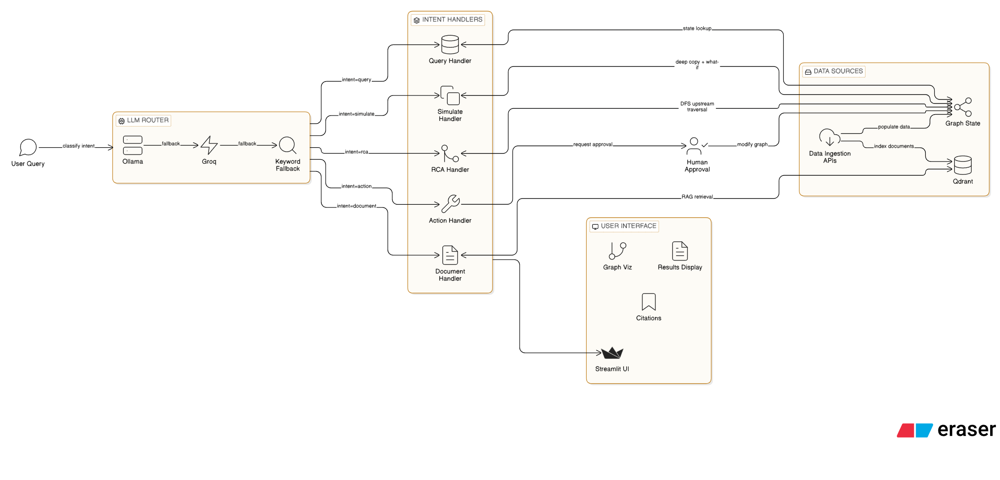

# Supply Chain Decision Intelligence - Complete Build Learnings

---

## Cues Column (Keywords & Questions)

- How does a multi-agent system route queries to the right handler?
- What is [[LangGraph StateGraph]] and how does state flow between nodes?
- Why model events as nodes instead of status flags?
- DFS for root cause, BFS for impact - why not the other way?
- What is [[simulate_change]] and why does it need deep copy?
- What is the RAG pipeline from document to answer?
- How does [[chunking strategy]] affect retrieval quality?
- What is [[cosine similarity]] and what scores are "good"?
- How does [[Qdrant]] store and retrieve vectors?
- What is the Ollama -> Groq -> Keyword fallback pattern?
- How does [[human-in-the-loop]] work in LangGraph?
- What are advanced RAG patterns (CRAG, Self-RAG, HyDE)?
- How to evaluate RAG with [[RAGAS]]?

---

## Notes Column

### System Architecture (What I Built)

The system is a **Supply Chain Decision Intelligence** prototype with 5 specialized agents orchestrated by LangGraph.



> [!info] Core Insight
> The system combines **structured data** (knowledge graph) with **unstructured data** (documents via RAG). Graph tells you WHAT is happening. Documents tell you WHAT TO DO about it.

---

### Knowledge Graph Design

#### Events as Nodes (Key Design Decision)

Events (Cyclone Dana, Labor Strike) are modeled as **separate nodes**, NOT as status changes on existing nodes.

**Why this matters:**
1. **Traceability** - Root cause agent traces back to the EVENT that caused disruption
2. **One-to-many** - Single event can affect multiple entities (Cyclone Dana affects port_1 AND route_2)
3. **Resolution** - Resolving an event = one operation that propagates to all affected nodes

```python
# Event affects multiple entities via edges
G.add_edge("event_1", "port_1", relationship="affects")
G.add_edge("event_1", "route_2", relationship="affects")
```

> [!tip] Interview Explanation
> "If I modeled events as status flags, I'd have port_1.status='congested' with no way to trace WHY. As a node, the root cause agent follows predecessors and finds Cyclone Dana directly."

#### Deliberate Bottleneck Design

Route_1 AND route_2 both connect to port_1. This creates a realistic bottleneck - if port_1 goes down, two routes are affected. This was intentional for demonstrating impact analysis.

#### Convergence vs Cycles

Warehouse stores product AND factory produces product - both edges point INTO product. This is **convergence** (multiple paths to same node), NOT a cycle. A cycle would require an edge from product back to factory/warehouse.

---

### Graph Traversal (DSA Application)

#### DFS for Root Cause (Upstream)

**Why DFS**: Traces as deep as possible along one branch before backtracking. Finds the root cause, not just the immediate predecessor.

```python
def trace_root_cause(G, node_id):
    visited = set()
    path = []
    
    def _dfs(node):
        if node in visited:
            return
        visited.add(node)
        path.append(node)
        for pred in G.predecessors(node):  # Upstream
            if pred not in visited:
                _dfs(pred)
    
    _dfs(node_id)
    return path
```

**Key**: Uses `G.predecessors()` because root cause is UPSTREAM.

**Time Complexity**: O(V + E)

**Traced Example**: `trace_root_cause(G, "warehouse_1")` returns 9 nodes:
`warehouse_1 -> port_1 -> route_1 -> factory_1 -> vendor_1 -> route_2 -> factory_2 -> vendor_2 -> event_1`

#### BFS for Impact Analysis (Downstream)

**Why BFS**: Explores level by level. Shows immediate impact first, then secondary, then tertiary. This layered view matters for reporting.

```python
def find_downstream_impact(G, node_id):
    visited = set()
    impacted = []
    queue = deque([node_id])
    
    while queue:
        current = queue.popleft()
        if current in visited:
            continue
        visited.add(current)
        for succ in G.successors(current):  # Downstream
            if succ not in visited:
                impacted.append(succ)
                queue.append(succ)
    
    return impacted
```

**Key**: Uses `G.successors()` because impact flows DOWNSTREAM. Uses `deque` for O(1) popleft.

**Filtering critical products from impact results:**
```python
critical = [n for n in impacted if G.nodes[n].get("priority") == "critical"]
```

---

### Agent Tools (The Four Operations)

| Tool | Purpose | Modifies Graph? |
|------|---------|-----------------|
| `query_state` | Read node attributes | No |
| `find_root_cause` | DFS upstream + enrich with attributes | No |
| `simulate_change` | Deep copy, apply changes, compare impact | No (copy only) |
| `execute_action` | Apply changes to real graph | Yes (needs approval) |

#### simulate_change - The Digital Twin Demo

```python
def simulate_change(G, node_id, changes):
    G_copy = copy.deepcopy(G)           # Clone entire graph
    for k, v in changes.items():
        G_copy.nodes[node_id][k] = v    # Modify clone only
    
    impact_before = find_downstream_impact(G, node_id)
    impact_after = find_downstream_impact(G_copy, node_id)
    
    return {
        'original': query_state(G, node_id),
        'simulated': query_state(G_copy, node_id),
        'impact_before': impact_before,
        'impact_after': impact_after,
        'newly_affected': [n for n in impact_after if n not in impact_before],
        'no_longer_affected': [n for n in impact_before if n not in impact_after]
    }
```

> [!info] Why newly_affected is empty
> `find_downstream_impact` follows graph STRUCTURE (edges). Changing node attributes doesn't add/remove edges, so downstream node SET is identical. The value is in comparing attribute states (before vs after). To change the impact set, you'd need to add/remove edges on the copy.

---

### LangGraph Orchestration

#### Core Concepts

**StateGraph**: A state machine where shared state (TypedDict) flows between function nodes.

```python
class AgentState(TypedDict):
    query: str
    intent: str
    node_id: str
    changes: Optional[Dict[str, Any]]
    result: Optional[Dict[str, Any]]
    approval: Optional[bool]
```

**Nodes**: Functions that read state, do work, return updated fields.
**Edges**: Normal (A always goes to B) or Conditional (A goes to B or C based on state).
**END**: Special constant meaning "stop, return final state."

> [!warning] Naming Confusion
> "Node" means different things:
> - **NetworkX node** = supply chain entity (port_1, factory_2)
> - **LangGraph node** = processing step (router, query_handler)

#### Conditional Routing

```python
def route_by_intent(state):
    mapping = {
        "query": "query_node",
        "rca": "rca_node",
        "simulate": "simulate_node",
        "action": "action_node",
        "document": "document_node"
    }
    return mapping.get(state["intent"], "query_node")

workflow.add_conditional_edges("router", route_by_intent, {...})
```

#### Human-in-the-Loop

`action_handler` checks `state["approval"]` before executing. If False, returns pending status. Graph only modified after explicit approval.

---

### RAG Pipeline (Document Intelligence Layer)

#### Pipeline Steps

```
Markdown docs -> Chunk by ## headers -> Embed with MiniLM -> Store in Qdrant -> Query -> Similarity search -> Return top-k with citations
```

#### Chunking Strategy

Used **markdown header splitting** - each `## section` becomes a chunk with header prepended.

**Why this over alternatives:**
- We control document structure (clear headers)
- Headers become natural metadata
- No risk of splitting mid-paragraph
- Better than fixed-size (respects semantic boundaries)
- Better than pure semantic splitting (simpler, deterministic)

**Chunk overlap**: Adjacent chunks share some content at boundaries to prevent losing context.

#### Embedding

**Model**: `all-MiniLM-L6-v2` (sentence-transformers)
- 384 dimensions
- Free, runs locally
- No API keys needed

**Cosine similarity score ranges:**
- 0.7+ = strong match
- 0.5-0.7 = reasonable match
- Below 0.4 = noise

#### Vector Store (Qdrant)

- **Collection** = table
- **Point** = row (id + vector + payload)
- **Payload** = metadata dict (text, source, section)

```python
PointStruct(
    id=uuid,
    vector=embedding.tolist(),
    payload={"text": ..., "source": ..., "section": ...}
)
```

In-memory mode (`QdrantClient(":memory:")`) for prototype. Docker/cloud for production.

#### Graph + RAG = Hybrid Intelligence

The key insight: **graph tells you WHAT, documents tell you WHAT TO DO**.

Example: "Is Tata Steel liable for the delay?"
1. Graph agent finds: Cyclone Dana (event_1) is active, affecting port_1 and route_2
2. Document agent retrieves: Tata Steel contract, force majeure clause covers cyclones
3. Combined answer: "No, force majeure applies. Cyclone Dana is active and the contract exempts natural disasters."

---

### LLM Router (Triple Fallback)

```
Ollama (llama3.1:8b local) -> Groq (cloud API) -> Keyword matching
```

**Why this pattern:**
- Ollama first: free, private, no latency to cloud
- Groq fallback: when Ollama is down or slow
- Keywords last resort: guaranteed to work, no LLM dependency

**Router prompt**: Classifies into 5 intents (query, rca, simulate, action, document). Returns ONLY the intent word. Temperature=0 for deterministic output.

**Validation**: If LLM returns anything not in valid_intents set, falls to next level.

---

### Advanced RAG Knowledge (Not Built, Can Discuss)

#### Retrieval Strategies
- **Hybrid search**: Dense (vector) + Sparse (BM25). Catches both semantic similarity and exact keyword matches.
- **Re-ranking**: Retrieve top-50 fast, then cross-encoder re-ranks to top-5. More accurate but slower.
- **MMR**: Maximal Marginal Relevance - balances relevance with diversity.
- **Multi-query**: LLM generates query variations, retrieves for each, merges results.

#### Advanced RAG Patterns
- **CRAG**: Grades retrieved chunks for relevance. Low relevance -> reformulate query and retry.
- **Self-RAG**: LLM decides if retrieval is needed, then self-evaluates its answer.
- **HyDE**: Generate hypothetical answer first, embed THAT, search with it. Better for vague queries.
- **Graph RAG**: Use knowledge graph to enrich retrieval queries. Our system does this.
- **Adaptive RAG**: Route to different strategies based on query complexity.

#### Evaluation (RAGAS)
- **Faithfulness**: Is the answer grounded in retrieved context? (no hallucination)
- **Answer Relevance**: Does the answer address the question?
- **Context Precision**: Are retrieved chunks relevant? (relevant chunks ranked higher)
- **Context Recall**: Were all necessary chunks retrieved?

#### Monitoring (LangFuse/LangSmith)
- Trace visualization, latency tracking, token usage, cost
- Retrieval quality over time (drift detection)
- Prompt versioning, user feedback collection

---

### Production Scaling (What I'd Change)

| Prototype | Production |
|-----------|------------|
| NetworkX (in-memory) | Neo4j (persistent, ACID, concurrent) |
| Qdrant in-memory | Qdrant Docker/Cloud (persistent) |
| all-MiniLM-L6-v2 | bge-large or OpenAI embeddings |
| Single LLM call for routing | Hybrid: BM25 + re-ranking |
| 5 markdown docs | Document parsing pipeline (PDF, Excel, PPT) |
| Keyword fallback router | DSPy-optimized prompts |
| No evaluation | RAGAS pipeline + LangFuse monitoring |
| Streamlit | FastAPI backend + React frontend |

---

## Summary

Built a complete multi-agent Supply Chain Decision Intelligence prototype demonstrating:
1. **Knowledge Graph as Digital Twin** - 18 entities, 21 relationships, DFS/BFS traversal
2. **5 Specialized Agents** - query, root cause, simulate, action, document
3. **LangGraph Orchestration** - state machine routing with conditional edges
4. **RAG Pipeline** - chunk, embed, store, retrieve with citations
5. **Human-in-the-Loop** - approval gate before graph modifications
6. **Triple LLM Fallback** - Ollama -> Groq -> Keywords
7. **Live Dashboard** - Streamlit with graph viz, agent trace, citations

---

## Tags

`#multi-agent` `#langgraph` `#knowledge-graph` `#networkx` `#rag` `#qdrant` `#ollama` `#groq` `#digital-twin` `#supply-chain` `#sentence-transformers` `#streamlit` `#dfs` `#bfs` `#human-in-the-loop`
