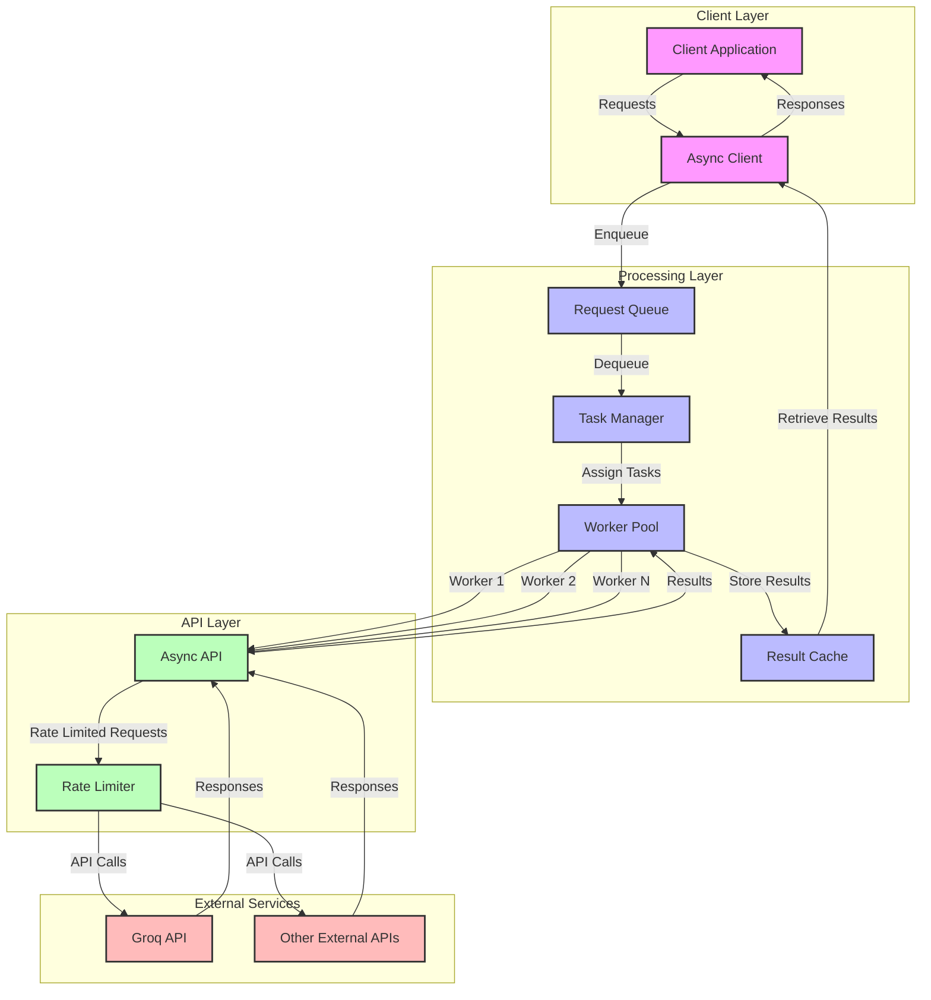
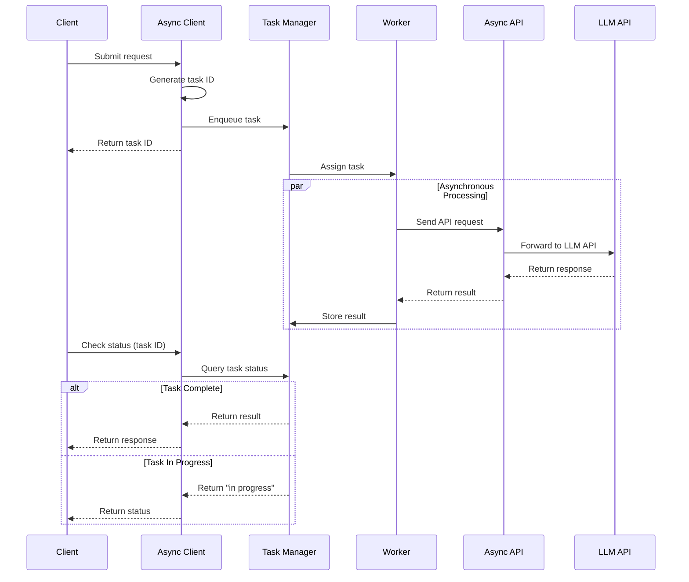
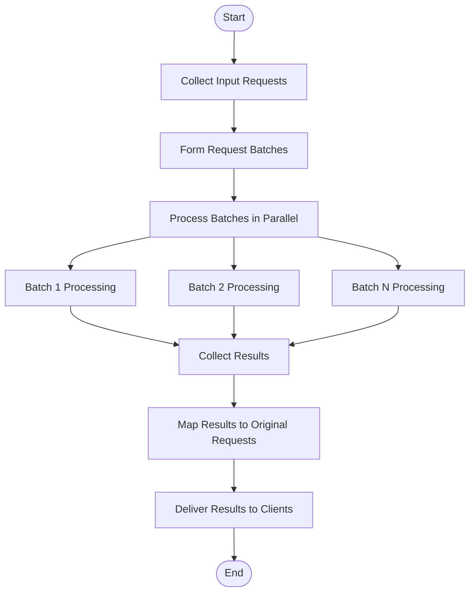
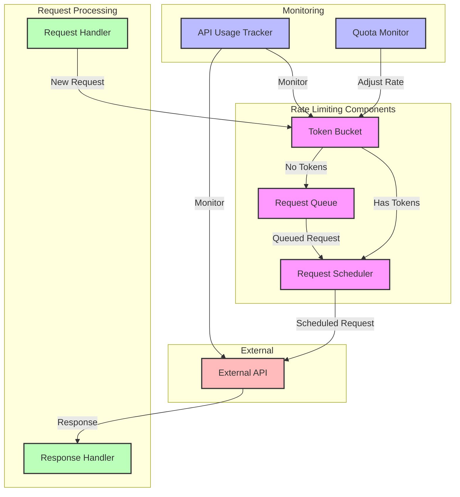
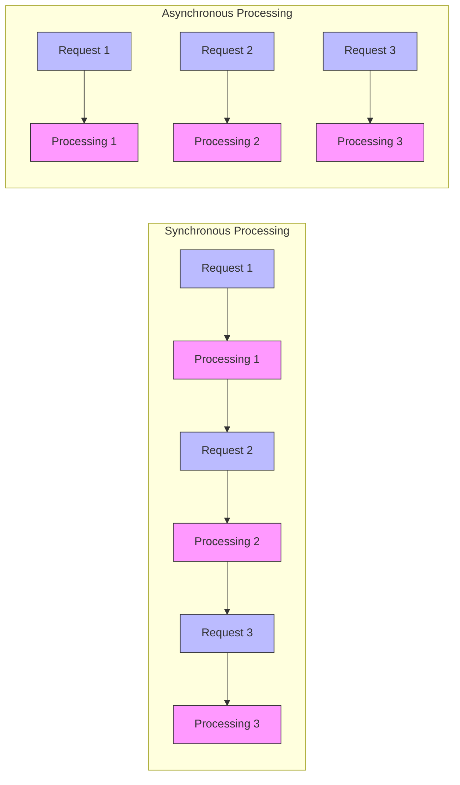
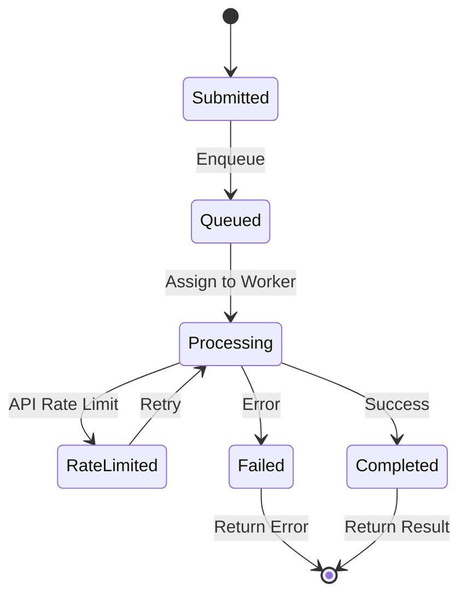

# Module 12: Performance Optimization

This document contains diagrams illustrating the performance optimization techniques in module 12, focusing on asynchronous processing.

## Asynchronous Processing Architecture

## Asynchronous Processing Sequence Diagram

## Batch Processing Flow

## Rate Limiting Strategy

## Performance Comparison

## State Diagram for Async Request

