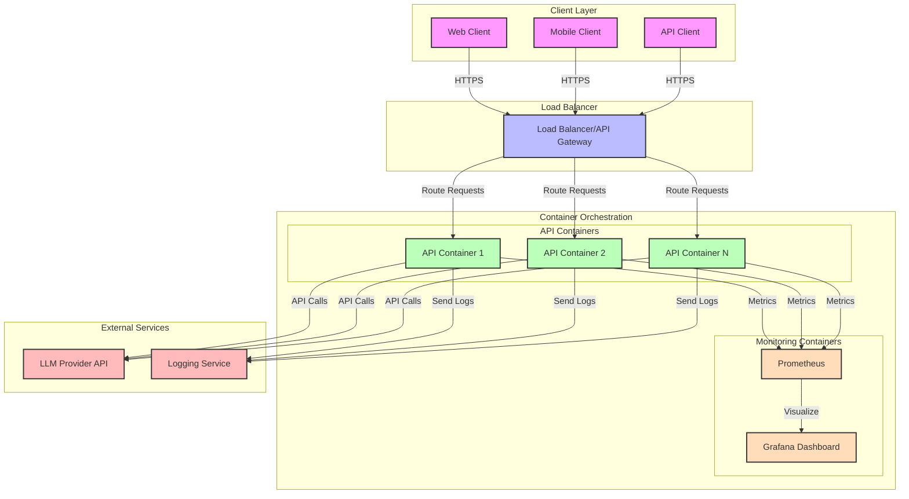
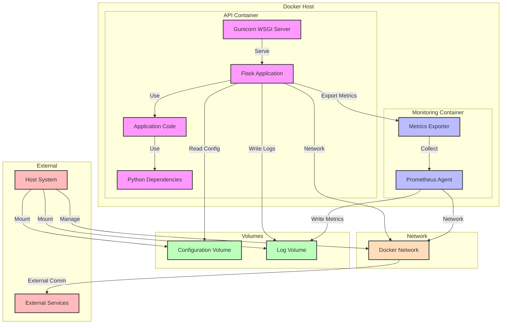
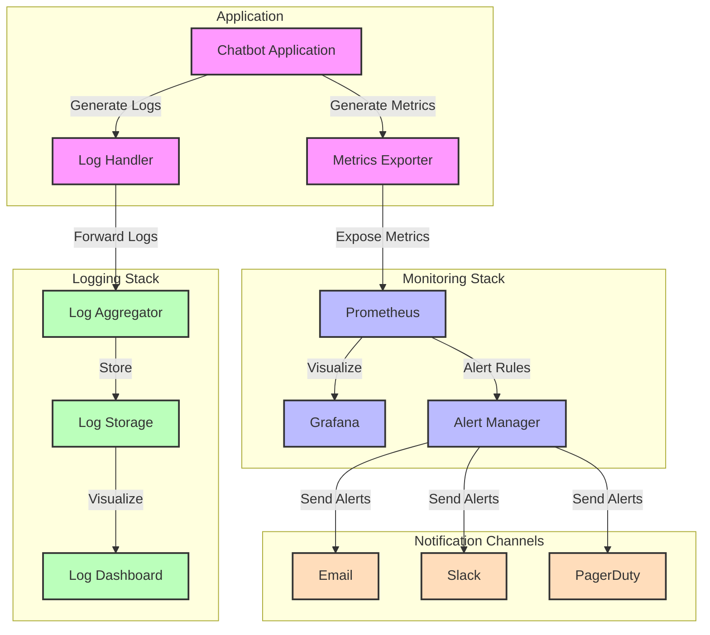

# Module 13: Production Deployment

This document contains diagrams illustrating the production deployment architecture and processes in module 13.

## Containerized Deployment Architecture



## Docker Container Architecture



## Cloud Deployment Options

```mermaid
graph TD
    subgraph "Deployment Options"
        subgraph "AWS"
            ECS[ECS/Fargate]
            Lambda[Lambda Functions]
            EC2[EC2 Instances]
            EKS[Kubernetes (EKS)]
        end
        
        subgraph "Azure"
            ACI[Container Instances]
            AKS[Kubernetes (AKS)]
            AppService[App Service]
            Functions[Azure Functions]
        end
        
        subgraph "GCP"
            CloudRun[Cloud Run]
            GKE[Kubernetes (GKE)]
            ComputeEngine[Compute Engine]
            CloudFunctions[Cloud Functions]
        end
    end
    
    subgraph "Deployment Characteristics"
        Scalability[Scalability]
        CostEfficiency[Cost Efficiency]
        Maintenance[Maintenance Effort]
        Performance[Performance]
    end
    
    %% AWS Connections
    ECS -->|High| Scalability
    ECS -->|Medium| CostEfficiency
    ECS -->|Low| Maintenance
    ECS -->|High| Performance
    
    Lambda -->|Very High| Scalability
    Lambda -->|High| CostEfficiency
    Lambda -->|Very Low| Maintenance
    Lambda -->|Medium| Performance
    
    EC2 -->|Medium| Scalability
    EC2 -->|Low| CostEfficiency
    EC2 -->|High| Maintenance
    EC2 -->|High| Performance
    
    EKS -->|Very High| Scalability
    EKS -->|Low| CostEfficiency
    EKS -->|High| Maintenance
    EKS -->|Very High| Performance
    
    %% Azure Connections
    ACI -->|High| Scalability
    ACI -->|Medium| CostEfficiency
    ACI -->|Low| Maintenance
    ACI -->|High| Performance
    
    AKS -->|Very High| Scalability
    AKS -->|Low| CostEfficiency
    AKS -->|High| Maintenance
    AKS -->|Very High| Performance
    
    AppService -->|High| Scalability
    AppService -->|Medium| CostEfficiency
    AppService -->|Low| Maintenance
    AppService -->|Medium| Performance
    
    Functions -->|Very High| Scalability
    Functions -->|High| CostEfficiency
    Functions -->|Very Low| Maintenance
    Functions -->|Medium| Performance
    
    %% GCP Connections
    CloudRun -->|High| Scalability
    CloudRun -->|High| CostEfficiency
    CloudRun -->|Very Low| Maintenance
    CloudRun -->|High| Performance
    
    GKE -->|Very High| Scalability
    GKE -->|Low| CostEfficiency
    GKE -->|High| Maintenance
    GKE -->|Very High| Performance
    
    ComputeEngine -->|Medium| Scalability
    ComputeEngine -->|Low| CostEfficiency
    ComputeEngine -->|High| Maintenance
    ComputeEngine -->|High| Performance
    
    CloudFunctions -->|Very High| Scalability
    CloudFunctions -->|High| CostEfficiency
    CloudFunctions -->|Very Low| Maintenance
    CloudFunctions -->|Medium| Performance
    
    classDef aws fill:#f9f,stroke:#333,stroke-width:2px;
    classDef azure fill:#bbf,stroke:#333,stroke-width:2px;
    classDef gcp fill:#bfb,stroke:#333,stroke-width:2px;
    classDef char fill:#fdb,stroke:#333,stroke-width:2px;
    
    class ECS,Lambda,EC2,EKS aws;
    class ACI,AKS,AppService,Functions azure;
    class CloudRun,GKE,ComputeEngine,CloudFunctions gcp;
    class Scalability,CostEfficiency,Maintenance,Performance char;
```

## Monitoring and Logging Architecture



## Security Architecture

```mermaid
graph TD
    subgraph "Security Layers"
        subgraph "Network Security"
            Firewall[Firewall]
            WAF[Web Application Firewall]
            HTTPS[HTTPS/TLS]
        end
        
        subgraph "Application Security"
            InputValidation[Input Validation]
            Authentication[Authentication]
            Authorization[Authorization]
            RateLimiting[Rate Limiting]
        end
        
        subgraph "Data Security"
            Encryption[Data Encryption]
            SecretsMgmt[Secrets Management]
            DataMinimization[Data Minimization]
        end
        
        subgraph "Operational Security"
            Logging[Security Logging]
            Monitoring[Security Monitoring]
            Updates[Regular Updates]
        end
    end
    
    subgraph "Threats"
        Injection[Injection Attacks]
        Unauthorized[Unauthorized Access]
        DataLeak[Data Leakage]
        DoS[Denial of Service]
        PromptInjection[Prompt Injection]
    end
    
    %% Protections
    Firewall -->|Protects Against| Unauthorized
    Firewall -->|Protects Against| DoS
    
    WAF -->|Protects Against| Injection
    WAF -->|Protects Against| Unauthorized
    
    HTTPS -->|Protects Against| DataLeak
    
    InputValidation -->|Protects Against| Injection
    InputValidation -->|Protects Against| PromptInjection
    
    Authentication -->|Protects Against| Unauthorized
    Authorization -->|Protects Against| Unauthorized
    
    RateLimiting -->|Protects Against| DoS
    
    Encryption -->|Protects Against| DataLeak
    SecretsMgmt -->|Protects Against| DataLeak
    DataMinimization -->|Protects Against| DataLeak
    
    Logging -->|Detects| Injection
    Logging -->|Detects| Unauthorized
    Logging -->|Detects| PromptInjection
    
    Monitoring -->|Detects| DoS
    Monitoring -->|Detects| Unauthorized
    
    Updates -->|Protects Against| Injection
    Updates -->|Protects Against| Unauthorized
    
    classDef network fill:#f9f,stroke:#333,stroke-width:2px;
    classDef app fill:#bbf,stroke:#333,stroke-width:2px;
    classDef data fill:#bfb,stroke:#333,stroke-width:2px;
    classDef ops fill:#fdb,stroke:#333,stroke-width:2px;
    classDef threat fill:#fbb,stroke:#333,stroke-width:2px;
    
    class Firewall,WAF,HTTPS network;
    class InputValidation,Authentication,Authorization,RateLimiting app;
    class Encryption,SecretsMgmt,DataMinimization data;
    class Logging,Monitoring,Updates ops;
    class Injection,Unauthorized,DataLeak,DoS,PromptInjection threat;
```


