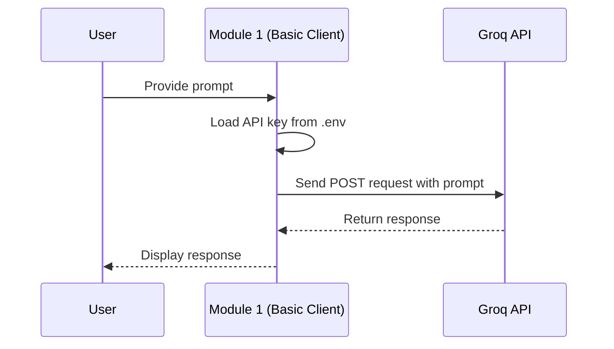
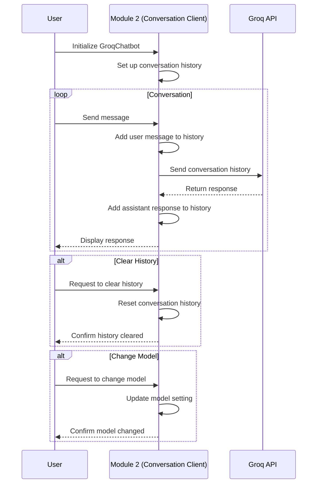
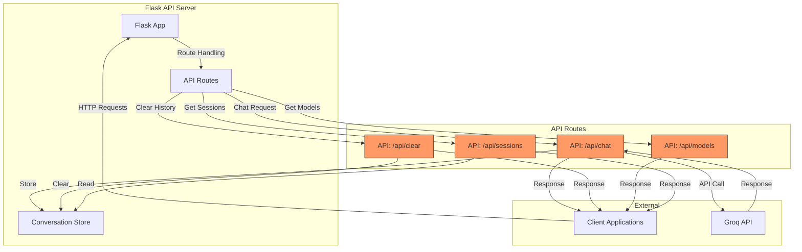
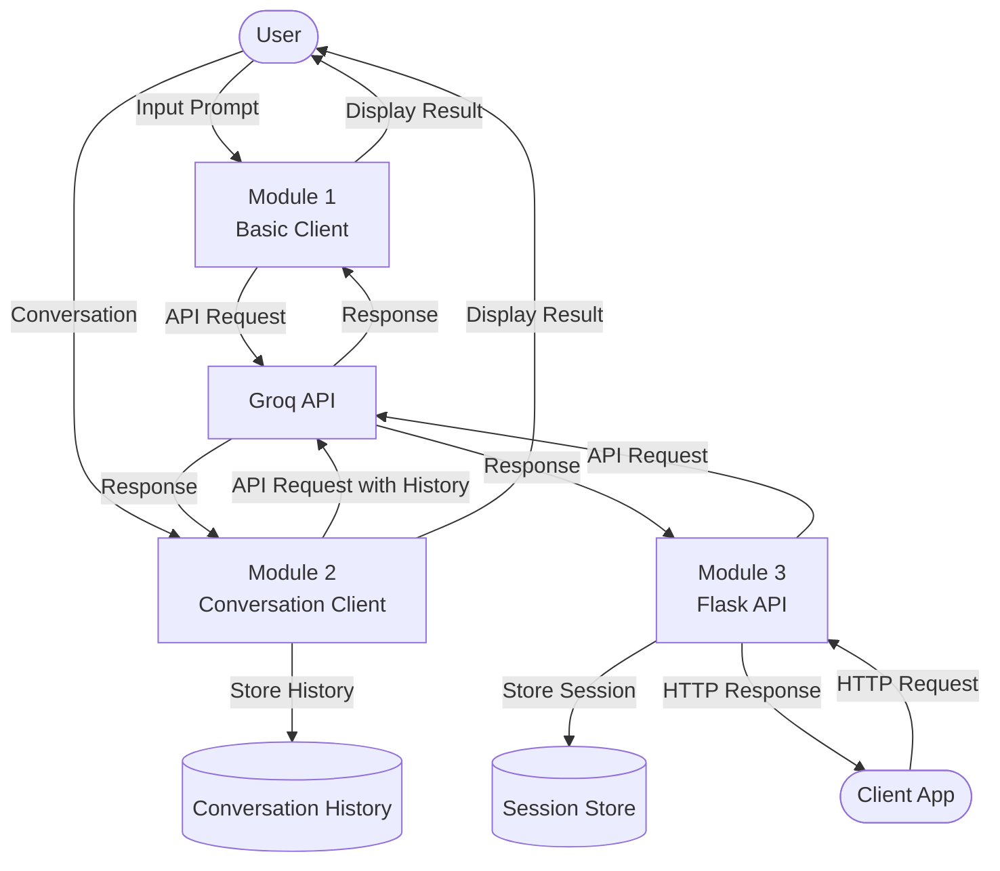

# Module 1-3: Basic API Integration Flow

This diagram illustrates the flow of data and interactions in the basic API integration modules (1-3).

## Sequence Diagram for Basic API Call (Module 1)

## Sequence Diagram for Conversation Client (Module 2)

## API Server Architecture (Module 3)

## Data Flow Diagram

