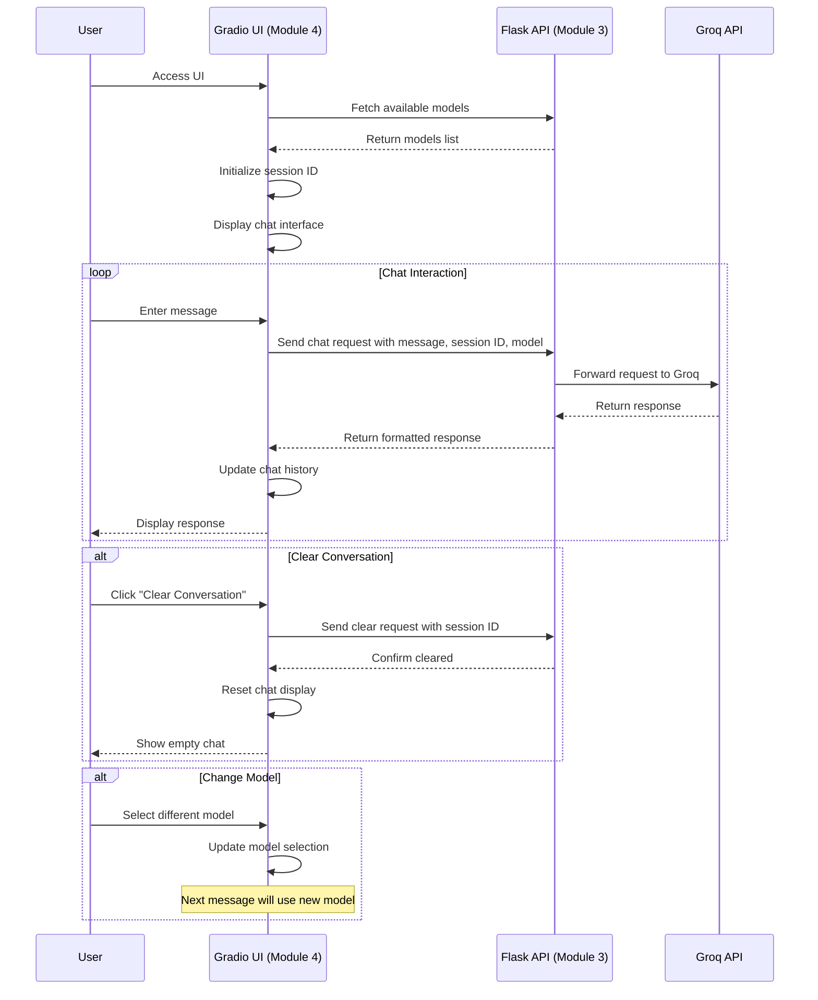
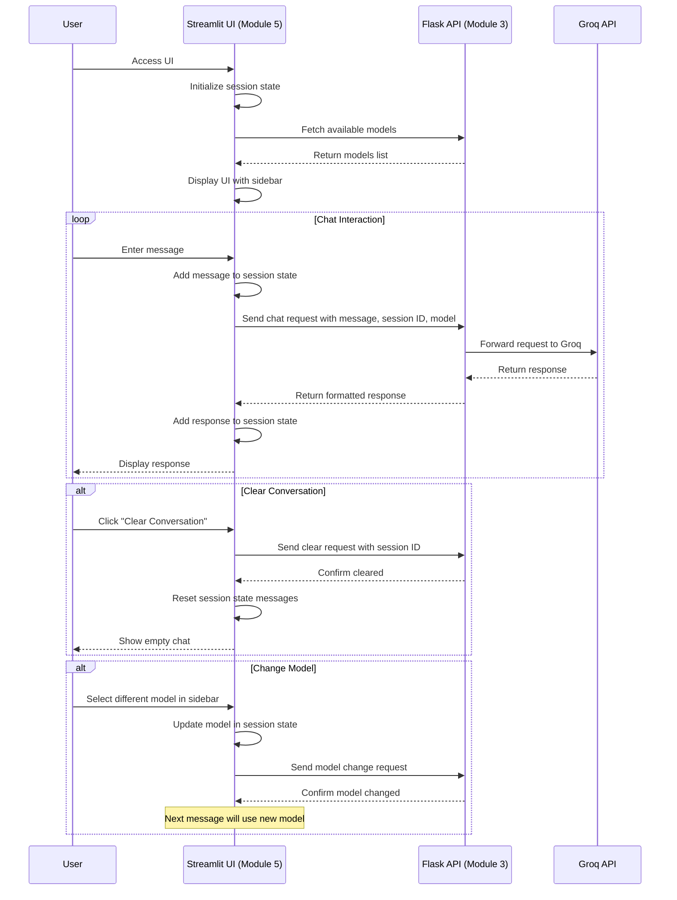
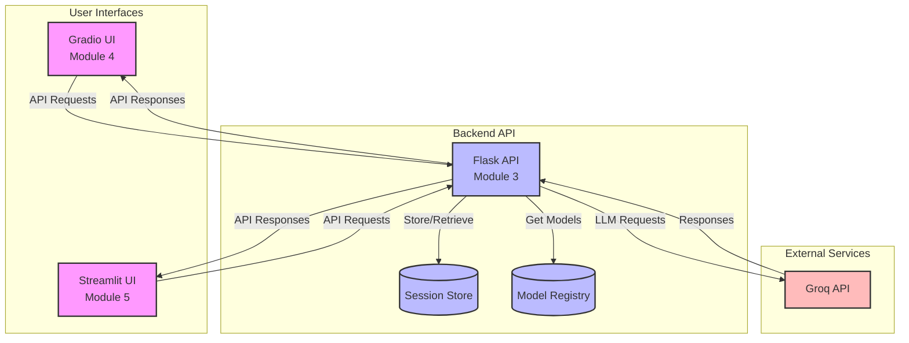
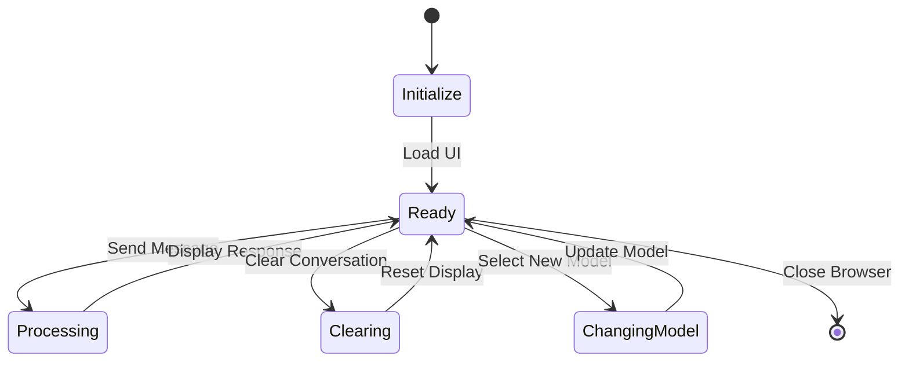

# Module 4-5: UI Integration Diagrams

This document contains diagrams illustrating the UI integration in modules 4 and 5 (Gradio and Streamlit interfaces).

## Sequence Diagram for Gradio UI (Module 4)

## Sequence Diagram for Streamlit UI (Module 5)

## Component Diagram for UI Integration

## State Diagram for UI Session

