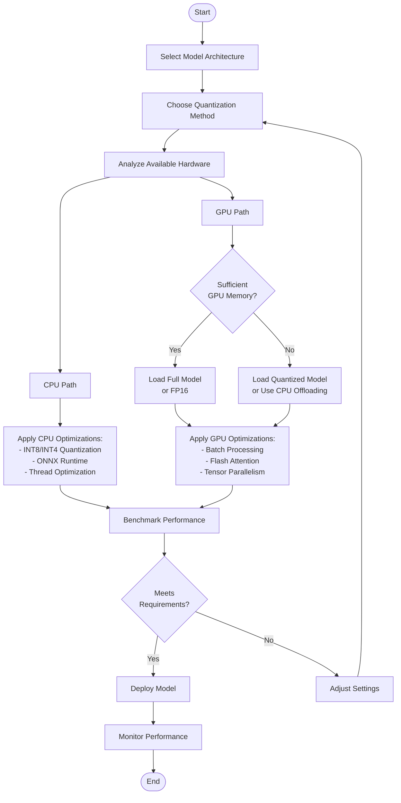
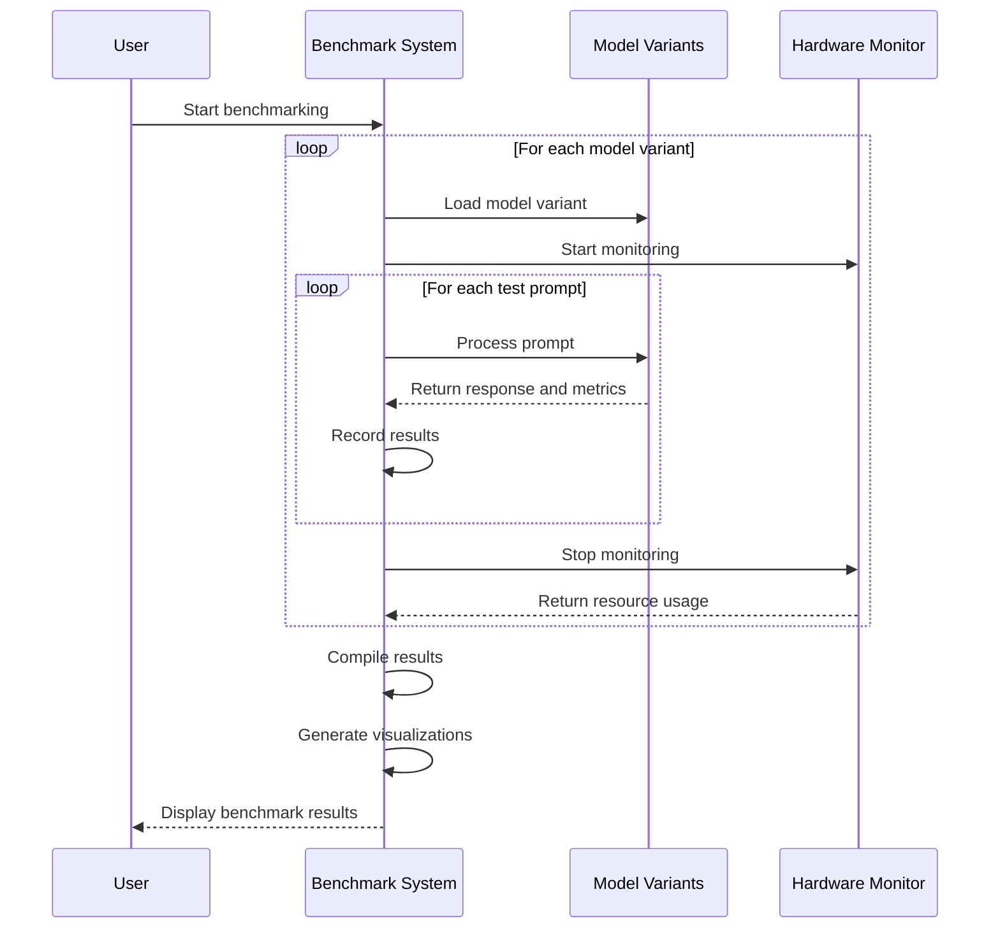

# Module 10-11: Model Deployment and Optimization

This document contains diagrams illustrating the model deployment and optimization techniques in modules 10 and 11.

## Model Quantization Comparison (Module 11)

```mermaid
graph TD
    subgraph "Model Quantization Types"
        FP32[Full Precision\nFP32]
        FP16[Half Precision\nFP16]
        INT8[8-bit Quantization\nINT8]
        INT4[4-bit Quantization\nINT4]
        GPTQ[GPTQ Quantization]
        AWQ[AWQ Quantization]
    end
    
    subgraph "Performance Metrics"
        Memory[Memory Usage]
        Speed[Inference Speed]
        Quality[Output Quality]
    end
    
    subgraph "Hardware Targets"
        CPU[CPU Deployment]
        GPU[GPU Deployment]
        Edge[Edge Devices]
    end
    
    %% Relationships
    FP32 -->|High| Memory
    FP32 -->|Low| Speed
    FP32 -->|Highest| Quality
    
    FP16 -->|Medium| Memory
    FP16 -->|Medium| Speed
    FP16 -->|High| Quality
    
    INT8 -->|Low| Memory
    INT8 -->|High| Speed
    INT8 -->|Medium| Quality
    
    INT4 -->|Lowest| Memory
    INT4 -->|Highest| Speed
    INT4 -->|Lower| Quality
    
    GPTQ -->|Low| Memory
    GPTQ -->|High| Speed
    GPTQ -->|Medium-High| Quality
    
    AWQ -->|Low| Memory
    AWQ -->|High| Speed
    AWQ -->|Medium-High| Quality
    
    FP32 -->|Compatible| CPU
    FP32 -->|Compatible| GPU
    
    FP16 -->|Limited| CPU
    FP16 -->|Optimal| GPU
    
    INT8 -->|Good| CPU
    INT8 -->|Good| GPU
    INT8 -->|Possible| Edge
    
    INT4 -->|Good| CPU
    INT4 -->|Good| GPU
    INT4 -->|Good| Edge
    
    GPTQ -->|Limited| CPU
    GPTQ -->|Good| GPU
    GPTQ -->|Possible| Edge
    
    AWQ -->|Limited| CPU
    AWQ -->|Good| GPU
    AWQ -->|Possible| Edge
    
    classDef quant fill:#f9f,stroke:#333,stroke-width:2px;
    classDef metrics fill:#bbf,stroke:#333,stroke-width:2px;
    classDef hardware fill:#bfb,stroke:#333,stroke-width:2px;
    
    class FP32,FP16,INT8,INT4,GPTQ,AWQ quant;
    class Memory,Speed,Quality metrics;
    class CPU,GPU,Edge hardware;
```

## Model Architecture Comparison

```mermaid
graph TD
    subgraph "Model Architectures"
        Decoder[Decoder-Only\nGPT-style]
        Encoder[Encoder-Only\nBERT-style]
        EncoderDecoder[Encoder-Decoder\nT5-style]
        MoE[Mixture of Experts]
        RAG[Retrieval-Augmented]
        MultiModal[Multi-Modal]
    end
    
    subgraph "Use Cases"
        TextGen[Text Generation]
        Classification[Classification]
        QA[Question Answering]
        Translation[Translation]
        Summarization[Summarization]
        ImageText[Image-Text Tasks]
    end
    
    subgraph "Performance Characteristics"
        ContextLength[Context Length]
        InferenceSpeed[Inference Speed]
        MemoryUsage[Memory Usage]
        Accuracy[Task Accuracy]
    end
    
    %% Relationships
    Decoder -->|Excellent| TextGen
    Decoder -->|Good| QA
    Decoder -->|Good| Summarization
    Decoder -->|Long| ContextLength
    Decoder -->|High| MemoryUsage
    
    Encoder -->|Excellent| Classification
    Encoder -->|Limited| TextGen
    Encoder -->|Short| ContextLength
    Encoder -->|Fast| InferenceSpeed
    
    EncoderDecoder -->|Good| Translation
    EncoderDecoder -->|Good| Summarization
    EncoderDecoder -->|Good| QA
    EncoderDecoder -->|Medium| ContextLength
    
    MoE -->|Excellent| TextGen
    MoE -->|Excellent| QA
    MoE -->|Very High| MemoryUsage
    MoE -->|High| Accuracy
    
    RAG -->|Excellent| QA
    RAG -->|Good| TextGen
    RAG -->|Factual| Accuracy
    RAG -->|Slower| InferenceSpeed
    
    MultiModal -->|Enables| ImageText
    MultiModal -->|Good| TextGen
    MultiModal -->|High| MemoryUsage
    MultiModal -->|Slower| InferenceSpeed
    
    classDef arch fill:#f9f,stroke:#333,stroke-width:2px;
    classDef use fill:#bbf,stroke:#333,stroke-width:2px;
    classDef perf fill:#bfb,stroke:#333,stroke-width:2px;
    
    class Decoder,Encoder,EncoderDecoder,MoE,RAG,MultiModal arch;
    class TextGen,Classification,QA,Translation,Summarization,ImageText use;
    class ContextLength,InferenceSpeed,MemoryUsage,Accuracy perf;
```

## Prompt Format Comparison

```mermaid
graph TD
    subgraph "Prompt Formats"
        LlamaFormat[LLaMA/Llama 2\nFormat]
        MistralFormat[Mistral Format]
        ChatMLFormat[ChatML Format]
        VicunaFormat[Vicuna/FastChat\nFormat]
        AlpacaFormat[Alpaca Format]
        TinyLlamaFormat[TinyLlama Format]
        GemmaFormat[Gemma Format]
    end
    
    subgraph "Format Components"
        SystemMsg[System Message]
        UserMsg[User Message]
        AssistantMsg[Assistant Message]
        Instruction[Instruction]
        Input[Input]
        Response[Response]
        SpecialTokens[Special Tokens]
    end
    
    %% Relationships
    LlamaFormat -->|Uses| SystemMsg
    LlamaFormat -->|Uses| UserMsg
    LlamaFormat -->|Uses| AssistantMsg
    LlamaFormat -->|Uses| SpecialTokens
    
    MistralFormat -->|Uses| SystemMsg
    MistralFormat -->|Uses| UserMsg
    MistralFormat -->|Uses| AssistantMsg
    MistralFormat -->|Uses| SpecialTokens
    
    ChatMLFormat -->|Uses| SystemMsg
    ChatMLFormat -->|Uses| UserMsg
    ChatMLFormat -->|Uses| AssistantMsg
    ChatMLFormat -->|Uses| SpecialTokens
    
    VicunaFormat -->|Uses| SystemMsg
    VicunaFormat -->|Uses| UserMsg
    VicunaFormat -->|Uses| AssistantMsg
    
    AlpacaFormat -->|Uses| Instruction
    AlpacaFormat -->|Uses| Input
    AlpacaFormat -->|Uses| Response
    
    TinyLlamaFormat -->|Uses| SystemMsg
    TinyLlamaFormat -->|Uses| UserMsg
    TinyLlamaFormat -->|Uses| AssistantMsg
    
    GemmaFormat -->|Uses| SystemMsg
    GemmaFormat -->|Uses| UserMsg
    GemmaFormat -->|Uses| AssistantMsg
    GemmaFormat -->|Uses| SpecialTokens
    
    classDef format fill:#f9f,stroke:#333,stroke-width:2px;
    classDef component fill:#bbf,stroke:#333,stroke-width:2px;
    
    class LlamaFormat,MistralFormat,ChatMLFormat,VicunaFormat,AlpacaFormat,TinyLlamaFormat,GemmaFormat format;
    class SystemMsg,UserMsg,AssistantMsg,Instruction,Input,Response,SpecialTokens component;
```

## Hardware Optimization Flow

## Benchmarking Process

