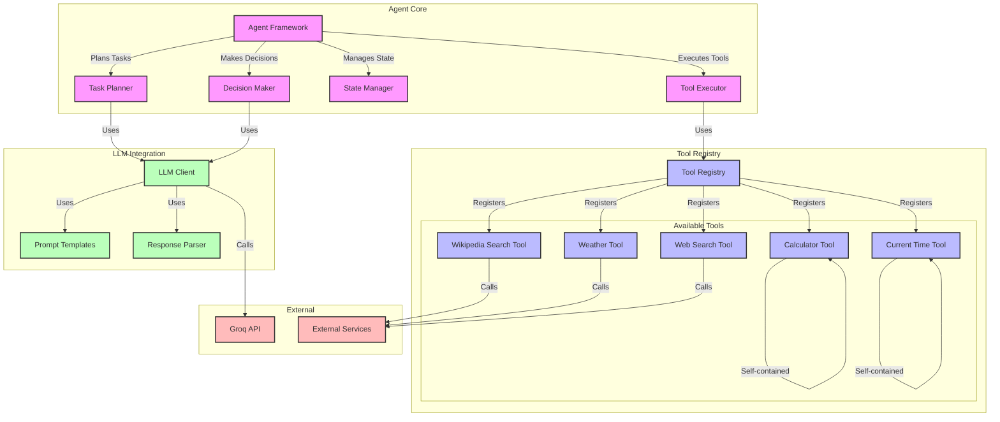
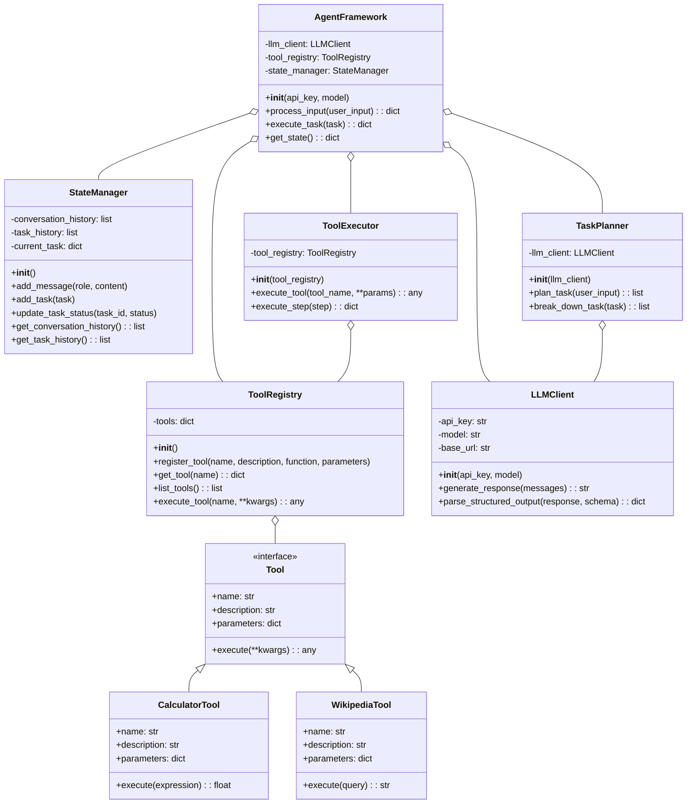
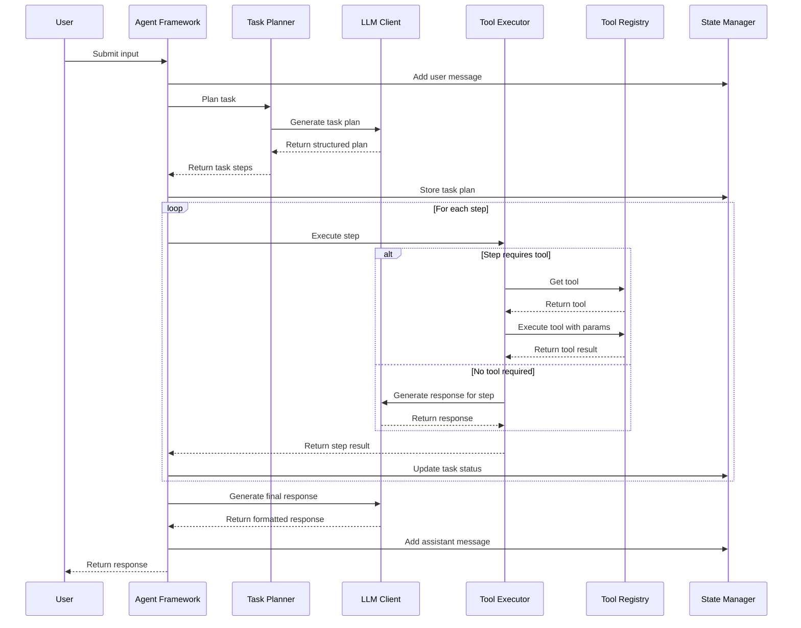
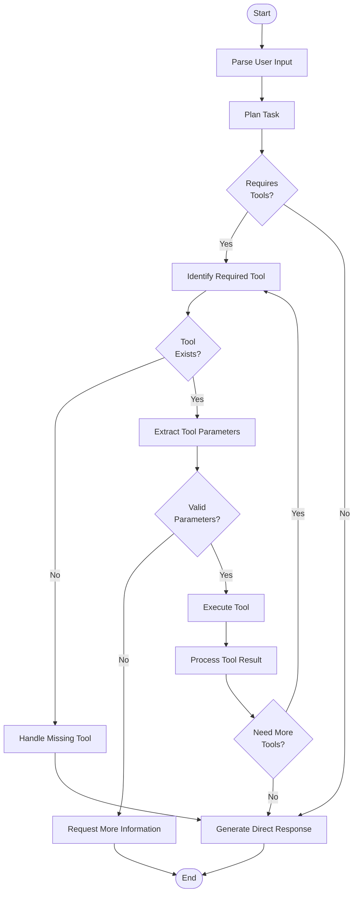
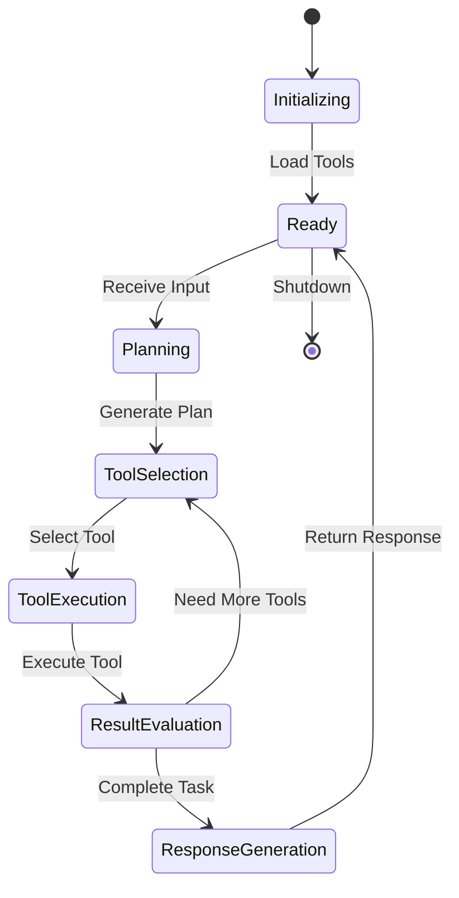
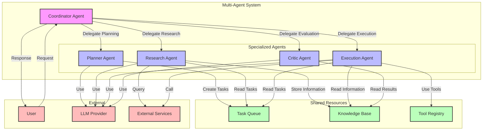

# Module 14: Agent Framework

This document contains diagrams illustrating the agent framework architecture and components in module 14.

## Agent Framework Architecture

## Agent Framework Class Diagram

## Agent Execution Sequence

## Tool Execution Flow

## Agent State Diagram

## Multi-Agent System Architecture

