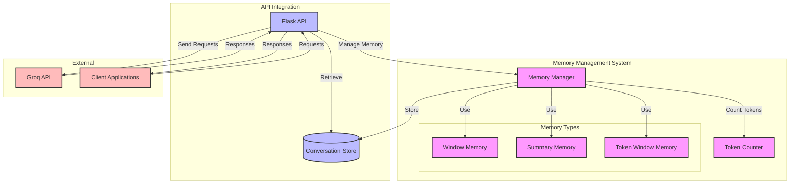
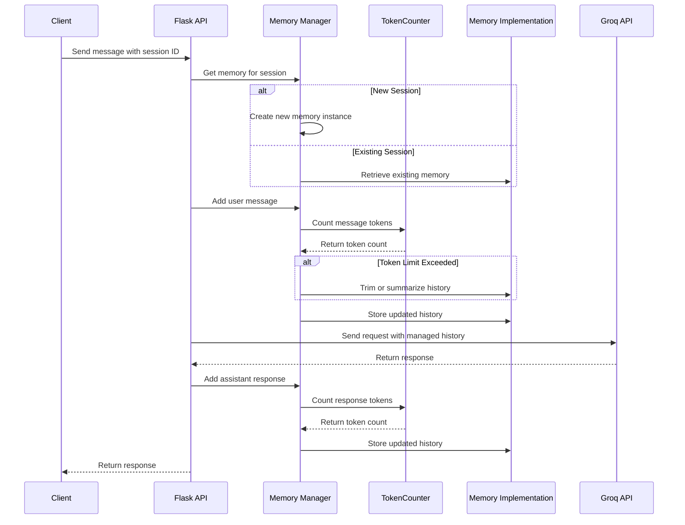
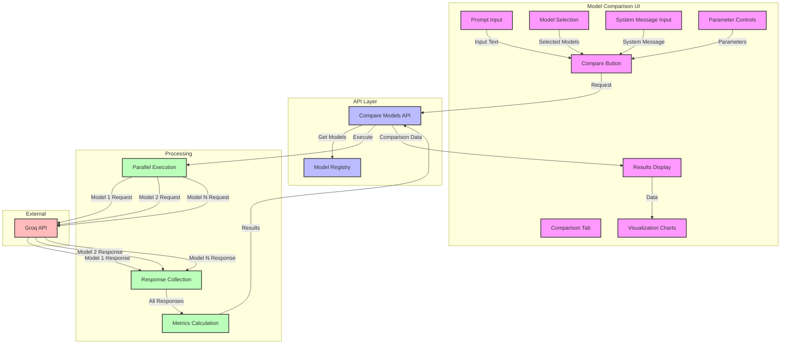
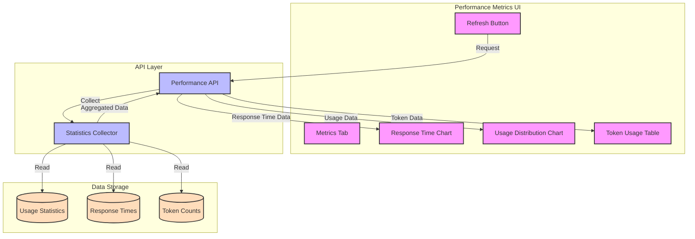
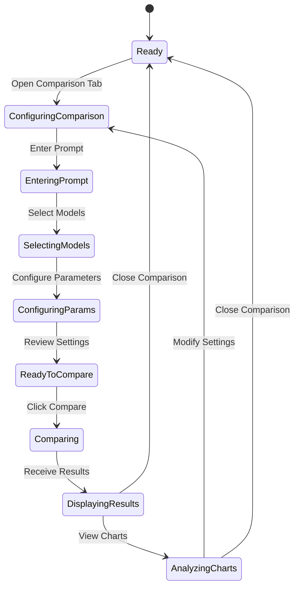

# Module 6-7: Advanced Features and Model Comparison

This document contains diagrams illustrating the advanced features in modules 6 and 7, focusing on memory management and model comparison.

## Memory Management Architecture (Module 6)

## Memory Management Sequence Diagram

## Model Comparison Flow (Module 7)

## Performance Metrics Dashboard Flow

## State Diagram for Model Comparison

