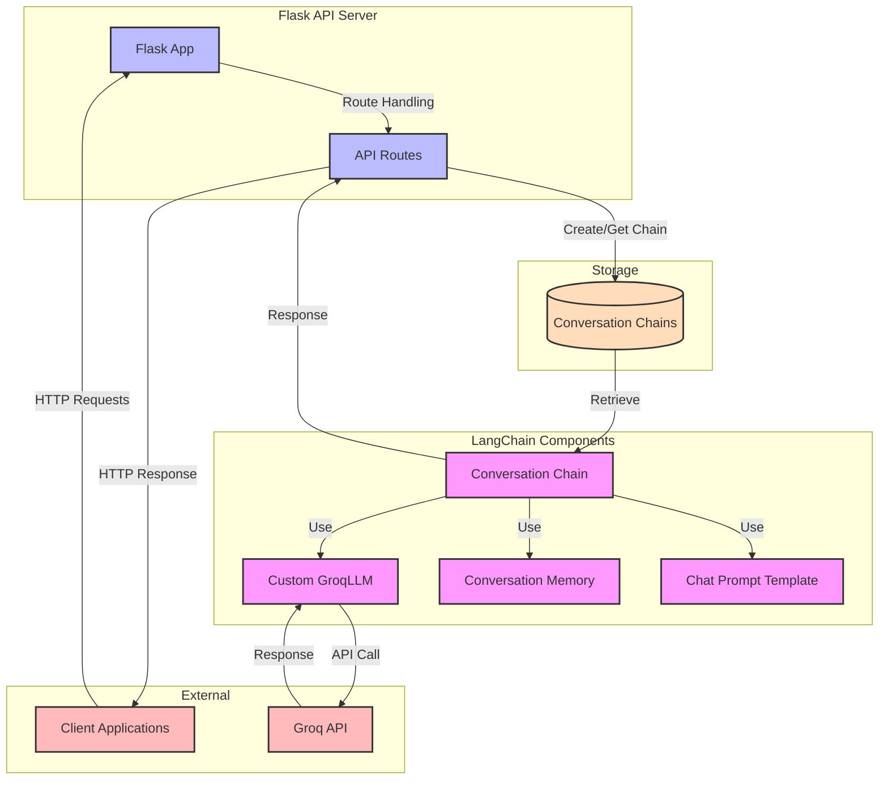
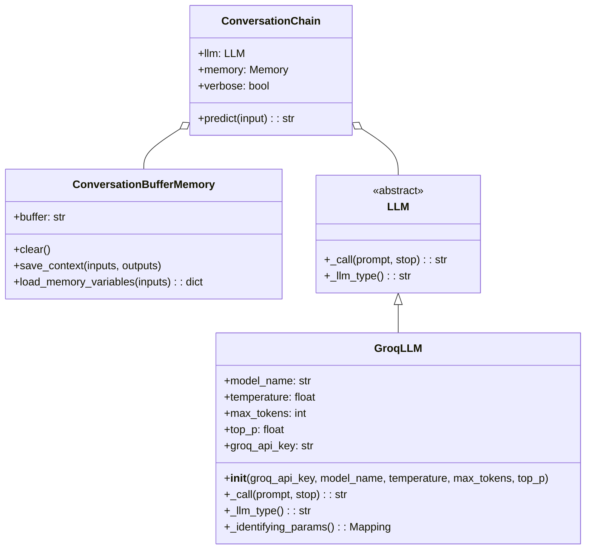
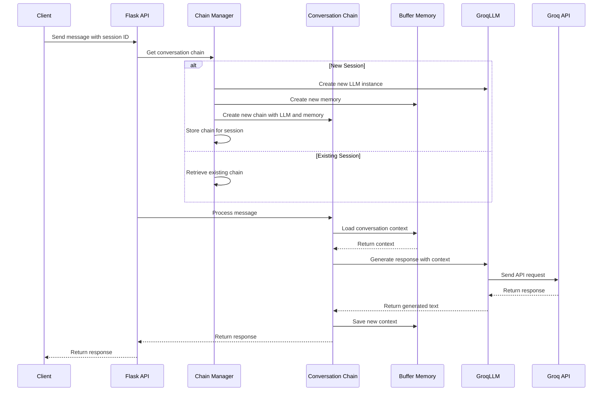
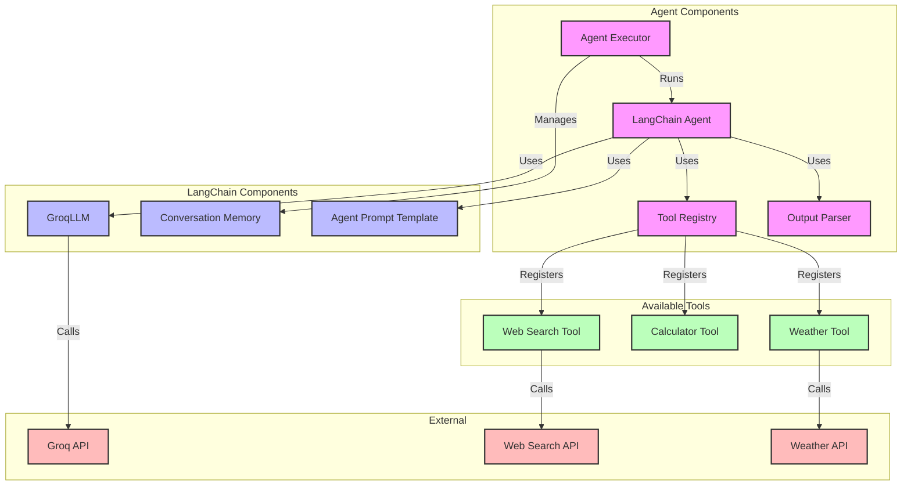
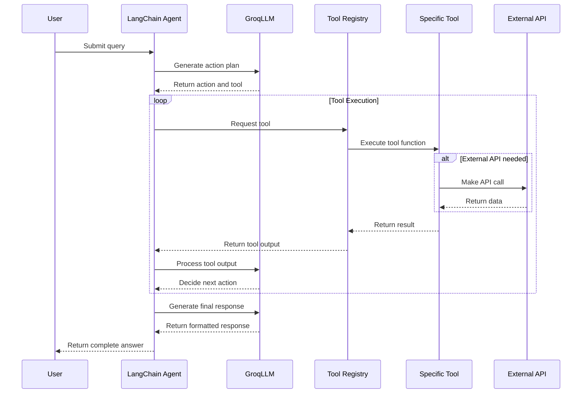
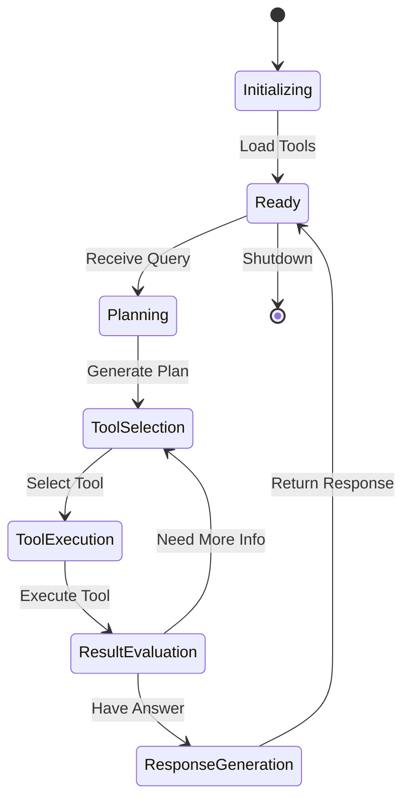

# Module 8-9: LangChain Integration

This document contains diagrams illustrating the LangChain integration in modules 8 and 9.

## LangChain Architecture (Module 8)

## LangChain Class Diagram

## LangChain Sequence Diagram

## Agent Framework (Module 9)

## Agent Execution Sequence

## Agent State Diagram

