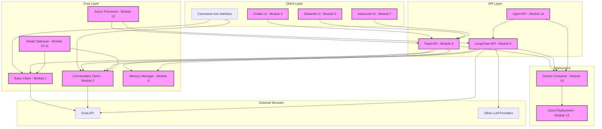

# System Architecture Diagram

This diagram shows the overall architecture of the chatbot system and how the different modules interact.

## Component Descriptions

### Client Layer
- **Command Line Interface**: Direct interaction with the core clients
- **Gradio UI (Module 4)**: Simple web UI for chatbot interaction
- **Streamlit UI (Module 5)**: More advanced web UI with additional features
- **Advanced UI (Module 7)**: UI for model comparison and performance metrics

### API Layer
- **Flask API (Module 3)**: RESTful API for chatbot interactions
- **LangChain API (Module 8)**: API with LangChain integration for advanced features
- **Agent API (Module 14)**: API for agent-based interactions with tools

### Core Layer
- **Basic Client (Module 1)**: Simple client for Groq API interaction
- **Conversation Client (Module 2)**: Client with conversation history management
- **Memory Manager (Module 6)**: Advanced memory management for conversations
- **Model Optimizer (Module 10-11)**: Optimization for model deployment and performance
- **Async Processor (Module 12)**: Asynchronous processing for improved performance

### External Services
- **Groq API**: Primary LLM provider
- **Other LLM Providers**: Alternative LLM services

### Deployment
- **Docker Container (Module 13)**: Containerization for deployment
- **Cloud Deployment (Module 13)**: Cloud deployment options
