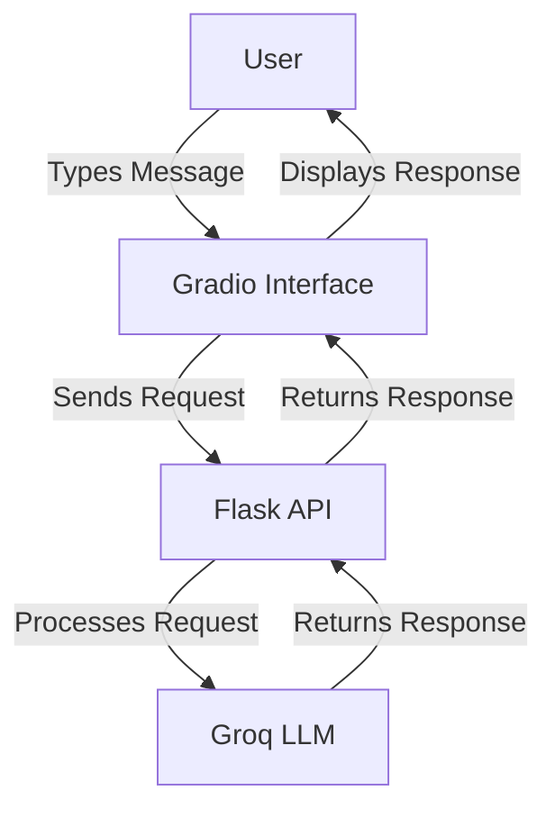
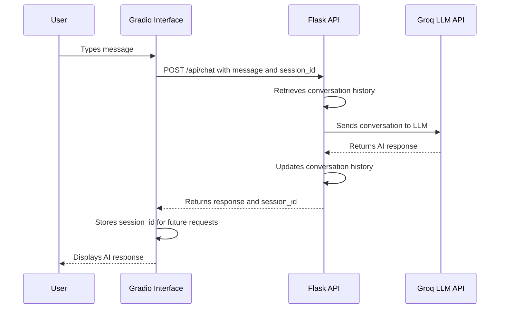

# 🚀 Module 4: Building a Web Interface with Gradio

## 📋 Prerequisites
Before starting this module, you should:
- 🌐 Have completed Module 3: Developing a Basic Flask API
- 🔌 Have a working Flask API for your chatbot
- 💻 Understand basic HTML and CSS concepts
- 🧩 Have a basic understanding of web components and interfaces
- 📦 Have the `gradio` package installed

## 🎯 Learning Objectives
By the end of this module, you will be able to:
- 🎨 Create an intuitive web interface for your chatbot
- 🔄 Connect a frontend interface to your Flask API
- 🧩 Customize UI components for better user experience
- 📱 Make your interface responsive for different devices
- 🚀 Deploy your complete chatbot application
- 🔍 Debug common frontend-backend integration issues

## 👋 Introduction
Welcome to Module 4 of our chatbot tutorial! In the previous module, we transformed our command-line chatbot into a web service by creating a Flask API. While this API is powerful, it's not very user-friendly—most people don't want to make HTTP requests manually!

🎨 In this module, we'll create an intuitive web interface for our chatbot using Gradio, a Python library designed specifically for building machine learning interfaces. This will allow users to interact with our chatbot through a graphical interface rather than API calls.

🔌 By connecting our Gradio interface to the Flask API we built in Module 3, we'll create a complete web application that anyone can use without technical knowledge. This is the final step in transforming our chatbot from a developer tool to a user-friendly application!

## 🧠 Key Concepts

### 🔍 Web Interfaces for AI Applications
A web interface serves as the bridge between your AI application and its users. A well-designed interface should:

1. **Be Intuitive**: Users should understand how to use it without instructions
2. **Provide Feedback**: Users should know when the system is processing their input
3. **Handle Errors Gracefully**: Problems should be communicated clearly
4. **Be Accessible**: The interface should work for users with different abilities
5. **Be Responsive**: It should work well on different devices and screen sizes

For our chatbot, we need an interface that mimics familiar messaging applications, with a message history display and an input field for new messages.



### 🔍 Gradio Framework
Gradio is a Python library that makes it easy to create web interfaces for machine learning models and other Python functions. It's perfect for our chatbot interface because:

1. **Simple API**: Create interfaces with just a few lines of code
2. **Built-in Components**: Includes chat interfaces, text boxes, and more
3. **Customizable**: Allows styling and layout customization
4. **Shareable**: Interfaces can be shared via public links
5. **Integrates with Python**: Works seamlessly with our existing code

With Gradio, we can create a chat interface that handles message display, user input, and API communication, all with minimal code.

### 🔍 Frontend-Backend Communication
Our application has two main parts:
- **Backend**: The Flask API that processes messages and communicates with the LLM
- **Frontend**: The Gradio interface that users interact with

These parts communicate through HTTP requests:
1. When a user sends a message, the frontend makes a POST request to the backend
2. The backend processes the message and returns a response
3. The frontend displays the response to the user

This separation of concerns allows us to:
- Develop and test each part independently
- Replace either part without affecting the other
- Scale each part according to its specific needs



## 🛠️ Step-by-Step Implementation

### ✨ Step 1: Setting Up the Gradio Environment
First, we need to set up our environment and import the necessary libraries:

```
# PSEUDOCODE: Setting up Gradio environment
1. Import necessary libraries (gradio, requests, json, etc.)
2. Define the API URL (where our Flask API is running)
3. Create variables to store the session ID and conversation history
```

This setup prepares our environment for creating the Gradio interface and communicating with our Flask API.

### ✨ Step 2: Creating API Communication Functions
Next, we'll create functions to communicate with our Flask API:

```
# PSEUDOCODE: API communication functions

# Function to send a message to the API
1. Define a function that takes a message as input
2. Check if we have a session ID stored
3. Prepare the request data (message and session ID if available)
4. Send a POST request to the API's chat endpoint
5. Parse the JSON response
6. Store the session ID from the response
7. Return the AI's response text

# Function to clear the conversation
1. Define a function with no parameters
2. Check if we have a session ID stored
3. If we have a session ID:
   - Send a POST request to the API's clear endpoint with the session ID
   - Reset the local conversation history
4. Return a confirmation message
```

These functions handle the communication between our Gradio interface and the Flask API, sending messages and clearing conversations as needed.

### ✨ Step 3: Creating the Chat Interface
Now we'll create the main chat interface using Gradio:

```
# PSEUDOCODE: Creating the Gradio chat interface
1. Define a function to handle chat interactions:
   - Take user message as input
   - Send message to API using our communication function
   - Return updated conversation history

2. Create a Gradio ChatInterface with:
   - Our chat handling function
   - A title for the interface
   - A description explaining how to use the chatbot
   - A clear button that calls our clear conversation function
   - Custom CSS for styling

3. Launch the interface:
   - Make it publicly accessible if needed
   - Set the server port
   - Configure sharing options
```

This creates a user-friendly chat interface that handles sending messages, displaying responses, and clearing conversations.

### ✨ Step 4: Customizing the Interface
To make our interface more appealing and user-friendly, we'll add some customizations:

```
# PSEUDOCODE: Customizing the interface
1. Define custom CSS to style the interface:
   - Set colors, fonts, and spacing
   - Style the message bubbles
   - Improve the input field appearance
   - Make the interface responsive

2. Add additional components:
   - A dropdown to select different AI models
   - A slider to adjust response length
   - Information panels explaining the chatbot's capabilities
   - Links to documentation or help resources

3. Update our chat function to use these new components:
   - Pass selected model to the API
   - Include response length preference in requests
```

These customizations make our interface more visually appealing and provide additional functionality for users.

## ⚠️ Common Challenges and Solutions

### 🚧 Handling Network Errors
**Challenge**: Network issues can cause API requests to fail, leading to a poor user experience.

**Solution**:
- 🔄 Implement error handling in API communication functions
- 🚨 Display user-friendly error messages
- 🔁 Add retry logic for failed requests

```
# PSEUDOCODE: Error handling for API requests
1. Wrap API requests in try-except blocks
2. If a request fails:
   - Log the error details for debugging
   - Check the type of error (timeout, connection error, etc.)
   - Display an appropriate message to the user
   - For temporary issues, offer a retry option
   - For persistent issues, suggest troubleshooting steps
```

### 🚧 Managing State Between Sessions
**Challenge**: If a user refreshes the page, their conversation history and session ID are lost.

**Solution**:
- 💾 Store session information in browser localStorage
- 🔄 Retrieve and restore session data when the interface loads
- 🔑 Provide options to manually save and restore sessions

```
# PSEUDOCODE: Persistent session management
1. When receiving a session ID from the API:
   - Store it in browser localStorage
   - Also store a timestamp for session expiration

2. When the interface loads:
   - Check localStorage for a session ID
   - If found and not expired, restore it
   - Fetch the conversation history from the API

3. Provide UI controls to:
   - Start a new session
   - Export conversation history
   - Import previous conversations
```

## 💡 Best Practices

1. **🎨 Consistent Design Language**: Use consistent colors, fonts, and styling throughout your interface to create a cohesive experience.

2. **⚡ Optimize Performance**: Minimize unnecessary API calls and optimize image sizes to ensure your interface loads quickly.

3. **📱 Mobile-First Design**: Design your interface to work well on mobile devices first, then enhance it for larger screens.

4. **🔄 Provide Loading Indicators**: Always show loading states when waiting for API responses to keep users informed.

5. **🛡️ Input Validation**: Validate user input before sending it to the API to prevent errors and improve security.

6. **🧪 Cross-Browser Testing**: Test your interface in different browsers and devices to ensure compatibility.

7. **♿ Accessibility**: Ensure your interface is accessible to users with disabilities by following WCAG guidelines.

## 📝 Summary
In this module, we've created a user-friendly web interface for our chatbot using Gradio. We've connected this interface to our Flask API, allowing users to interact with our chatbot through a graphical interface rather than API calls.

Key accomplishments:
- 🎨 Created an intuitive chat interface with Gradio
- 🔌 Connected our frontend to our Flask API backend
- 🧩 Added customizations to improve the user experience
- 🛡️ Implemented error handling for network issues
- 💾 Added session management to preserve conversations
- 📱 Made our interface responsive for different devices

This completes our chatbot application, transforming it from a command-line tool to a full-fledged web application that anyone can use!

## 🏋️ Exercises
Try these exercises to reinforce your learning:

1. **🎨 Theme Customization**: Add a theme selector that allows users to choose between light and dark modes.

2. **📊 Conversation Analytics**: Add a feature that analyzes conversations and displays statistics like message count, average response time, and common topics.

3. **📱 Progressive Web App**: Convert your Gradio interface into a Progressive Web App (PWA) that can be installed on mobile devices.

4. **🔊 Voice Input/Output**: Add speech-to-text and text-to-speech capabilities to allow voice conversations with your chatbot.

5. **🌐 Multi-Language Support**: Implement language detection and translation to make your chatbot accessible to users who speak different languages.

## 📚 Further Reading
- 📖 [Gradio Documentation](https://gradio.app/docs/)
- 🎨 [Web Design Principles for AI Interfaces](https://www.smashingmagazine.com/2019/12/design-voice-interfaces/)
- 📱 [Responsive Web Design Best Practices](https://www.smashingmagazine.com/2011/01/guidelines-for-responsive-web-design/)
- 🔌 [Frontend-Backend Integration Patterns](https://www.patterns.dev/posts/api-integration-patterns)
- ♿ [Web Accessibility Guidelines](https://www.w3.org/WAI/standards-guidelines/wcag/)

## ⏭️ Next Steps
Congratulations on completing all four modules of our chatbot tutorial! You now have a fully functional, user-friendly chatbot application that you can continue to enhance and customize.

Here are some directions you might explore next:
- 🧠 Implement more advanced conversation capabilities like entity recognition or sentiment analysis
- 🔌 Integrate with external services like weather APIs or calendar systems
- 🤖 Deploy your chatbot to a production environment using cloud services
- 📱 Create native mobile apps that connect to your chatbot API
- 🧪 Conduct user testing to gather feedback and improve your chatbot's performance

Remember, building a great chatbot is an iterative process. Continue to gather feedback, make improvements, and explore new possibilities. The skills you've learned in this tutorial provide a solid foundation for creating all kinds of AI-powered applications. Happy building! 🚀
