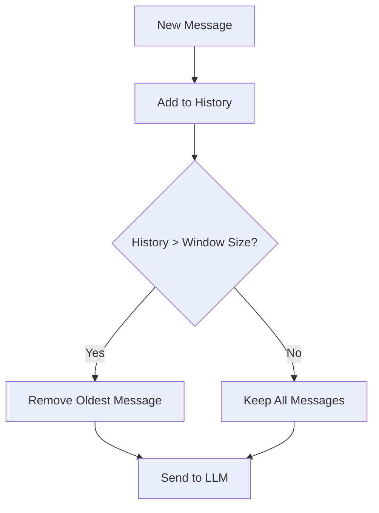
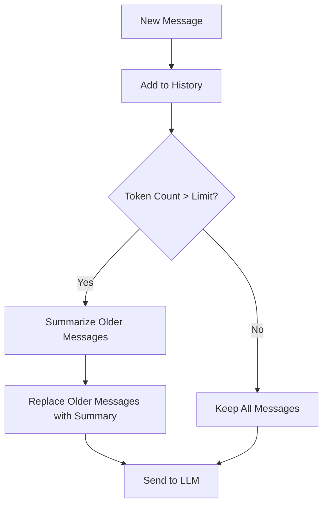
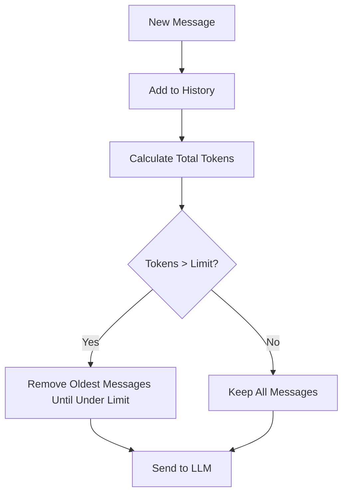

# 🧠 Memory and Context Management

## 📋 Prerequisites
Before starting this module, you should:
- Have completed Module 5 on Streamlit interfaces
- Understand basic Flask API development (Module 3)
- Be familiar with Python classes and object-oriented programming
- Have your Groq API key set up in your environment variables

## 🎯 Learning Objectives
By the end of this module, you will be able to:
- Understand the challenges of token limitations in LLM conversations
- Implement different memory management strategies for chatbots
- Create a system that maintains conversation context efficiently
- Compare window-based and summary-based approaches to memory management
- Optimize token usage in your chatbot applications

## 👋 Introduction
When building chatbots with large language models (LLMs), one of the most significant challenges is managing conversation context. LLMs have token limits that restrict how much information can be included in a single prompt. As conversations grow longer, they can exceed these limits, causing the model to lose important context.

In this module, we'll explore different strategies for managing conversation memory and context. We'll implement three distinct approaches: window-based memory, summary-based memory, and token-optimized memory. Each has its own advantages and trade-offs, which we'll examine in detail.

By mastering these memory management techniques, you'll be able to create chatbots that maintain coherent, contextual conversations over extended interactions, providing a much more natural and helpful user experience.

## 🧠 Key Concepts

### 🔍 Token Limitations
LLMs process text as tokens, which are roughly equivalent to parts of words. Most models have a maximum context length (token limit) for both input and output combined.

```
Example: The sentence "I love building chatbots with Python!" might be tokenized as:
["I", "love", "building", "chat", "bots", "with", "Python", "!"]
```

When a conversation history grows too long, it can exceed the model's token limit, causing:
- Loss of earlier context
- Inability to reference previous parts of the conversation
- Potential for repetitive or inconsistent responses

Different models have different token limits:
- Llama 3 (70B): 8,192 tokens
- Mixtral 8x7B: 32,768 tokens
- GPT-4: 8,192 to 32,768 tokens (depending on version)

### 🔍 Memory Management Strategies

There are several approaches to managing conversation memory:

#### Window-Based Memory
Keeps a fixed number of the most recent messages, discarding older ones.



#### Summary-Based Memory
Periodically summarizes older messages to maintain context while reducing token usage.



#### Token-Optimized Memory
Focuses on maximizing the number of messages that can fit within the token limit.



### 🔍 Token Counting
Accurately estimating token counts is essential for effective memory management. While exact token counts depend on the specific tokenizer used by each model, we can use approximations:

```
FUNCTION estimate_tokens(text)
    // Estimate tokens using the ~4 characters per token rule of thumb
    RETURN length(text) / 4
END FUNCTION
```

This is a simplified approach - production systems often use model-specific tokenizers for precise counts.

## 🛠️ Step-by-Step Implementation

### ✨ Step 1: Creating the Base Memory Class

First, we'll create a base class that all memory strategies will inherit from:

```
CLASS ConversationMemory
    // Base class for conversation memory strategies

    FUNCTION initialize(system_message = "You are a helpful AI assistant.")
        // Initialize with a system message
        this.system_message = system_message
        this.messages = [{role: "system", content: system_message}]
        this.created_at = current_time()
        this.last_updated = current_time()
    END FUNCTION

    FUNCTION add_message(role, content)
        // Add a message to the conversation history
        APPEND {role: role, content: content} TO this.messages
        this.last_updated = current_time()
    END FUNCTION

    FUNCTION get_messages()
        // Return all messages
        RETURN this.messages
    END FUNCTION

    FUNCTION clear()
        // Clear all messages except system message
        this.messages = [{role: "system", content: this.system_message}]
    END FUNCTION
END CLASS
```

### ✨ Step 2: Implementing Window-Based Memory

The window-based approach keeps a fixed number of recent messages:

```
CLASS WindowMemory EXTENDS ConversationMemory
    // Conversation memory that keeps a sliding window of messages

    FUNCTION initialize(system_message="You are a helpful AI assistant.", window_size=10)
        // Initialize with a window size
        CALL parent.initialize(system_message)
        this.window_size = window_size
        this.full_history = []  // Store all messages for reference
    END FUNCTION

    FUNCTION add_message(role, content)
        // Add message and trim if needed
        message = {role: role, content: content}

        // Add to full history
        APPEND message TO this.full_history

        // Add to current messages
        APPEND message TO this.messages
        this.last_updated = current_time()

        // Trim if needed (always keep system message)
        IF length(this.messages) > this.window_size + 1 THEN
            // Keep system message and last N messages
            this.messages = [this.messages[0]] + this.messages[-(this.window_size):]
        END IF
    END FUNCTION
END CLASS
```

### ✨ Step 3: Implementing Summary-Based Memory

The summary approach periodically condenses older messages:

```
CLASS SummaryMemory EXTENDS ConversationMemory
    // Conversation memory that periodically summarizes old messages

    FUNCTION initialize(system_message="You are a helpful AI assistant.",
                 active_window=6, max_tokens=4000, api_key=NULL)
        // Initialize with active window and summarization settings
        CALL parent.initialize(system_message)
        this.active_window = active_window
        this.max_tokens = max_tokens
        this.api_key = api_key
        this.summary = NULL
    END FUNCTION

    FUNCTION add_message(role, content)
        // Add message and summarize if needed
        // Add the new message
        CALL parent.add_message(role, content)

        // Check if we need to summarize
        IF get_token_count() > this.max_tokens THEN
            CALL this._create_summary()
        END IF
    END FUNCTION

    FUNCTION _create_summary()
        // Summarize older messages
        // Keep system message and active window
        messages_to_summarize = this.messages[1:-this.active_window]

        IF empty(messages_to_summarize) THEN
            RETURN
        END IF

        // Create conversation text for summary
        conversation_text = JOIN messages_to_summarize WITH newlines, formatted as "role: content"

        // Get summary using the API
        summary = CALL this._generate_summary(conversation_text)

        IF summary THEN
            this.summary = summary
            // Update messages to: [system, summary, active_window_messages]
            this.messages = [
                this.messages[0],  // System message
                {role: "system", content: "Previous conversation summary: " + summary},
                ...this.messages[-this.active_window:]  // Active window
            ]
        END IF
    END FUNCTION
END CLASS
```

### ✨ Step 4: Implementing Token-Optimized Memory

This approach focuses on maximizing content within token limits:

```
CLASS TokenWindowMemory EXTENDS ConversationMemory
    // Memory that maintains a token-based window rather than message count

    FUNCTION initialize(system_message="You are a helpful AI assistant.", max_tokens=6000)
        // Initialize with a maximum token count
        CALL parent.initialize(system_message)
        this.max_tokens = max_tokens
    END FUNCTION

    FUNCTION add_message(role, content)
        // Add message and trim older messages if token limit exceeded
        // Add the new message
        message = {role: role, content: content}
        APPEND message TO this.messages
        this.last_updated = current_time()

        // Trim if we exceed token limit
        current_tokens = CALL this.get_token_count()

        WHILE current_tokens > this.max_tokens AND length(this.messages) > 2 DO
            // Remove oldest non-system message
            REMOVE this.messages[1]
            // Recalculate tokens
            current_tokens = CALL this.get_token_count()
        END WHILE
    END FUNCTION
END CLASS
```

## ⚠️ Common Challenges and Solutions

### 🚧 Balancing Context and Token Usage
**Problem**: Keeping too much context consumes tokens, but too little loses important information.

**Solution**:
- Start with a token-optimized approach that dynamically adjusts based on message importance
- Consider hybrid approaches that combine window and summary methods
- Experiment with different window sizes and summarization thresholds for your specific use case

### 🚧 Accurate Token Counting
**Problem**: Estimating tokens inaccurately can lead to unexpected truncation or inefficient token usage.

**Solution**:
- Use model-specific tokenizers when possible
- Build in safety margins (e.g., target 90% of the actual limit)
- Implement monitoring to track actual token usage vs. estimates

## 💡 Best Practices

1. **Start Simple**: Begin with window-based memory before implementing more complex strategies
2. **Monitor Performance**: Track token usage, response quality, and user satisfaction
3. **Hybrid Approaches**: Consider combining strategies (e.g., window + summary)
4. **Customize Per Use Case**: Different applications may need different memory strategies
5. **User Control**: Allow users to clear context or start new conversations
6. **Persistence**: Consider storing conversation histories in a database for long-term context

## 📝 Summary
In this module, we explored different strategies for managing conversation memory in chatbots. We implemented three approaches:

1. **Window-Based Memory**: Keeps a fixed number of recent messages
2. **Summary-Based Memory**: Periodically summarizes older messages
3. **Token-Optimized Memory**: Maximizes content within token limits

Each approach has its strengths and ideal use cases. By implementing these strategies, you can create chatbots that maintain coherent conversations while efficiently managing token usage.

## 🏋️ Exercises
Try these exercises to reinforce your learning:

1. Implement a hybrid memory strategy that combines window and summary approaches
2. Create a visualization tool that shows token usage across different memory strategies
3. Extend the SummaryMemory class to prioritize certain message types when summarizing
4. Implement a feature that allows users to "pin" important messages so they're never removed from context

## 📚 Further Reading
- [LangChain Memory Documentation](https://python.langchain.com/docs/modules/memory/)
- [Anthropic's Context Window Research](https://www.anthropic.com/research)
- [Hugging Face Tokenizers Library](https://huggingface.co/docs/tokenizers/index)
- [OpenAI Cookbook: Techniques to improve reliability](https://github.com/openai/openai-cookbook/blob/main/techniques_to_improve_reliability.md)

## ⏭️ Next Steps
In the next module, we'll build on our memory management knowledge to implement multi-model support. You'll learn how to allow users to select different models, tune parameters, and compare model performance - all while maintaining the efficient memory management strategies we've developed here.
