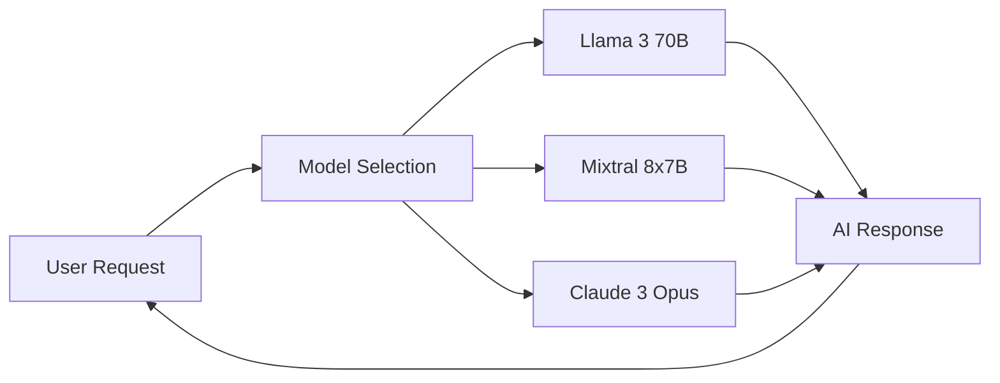
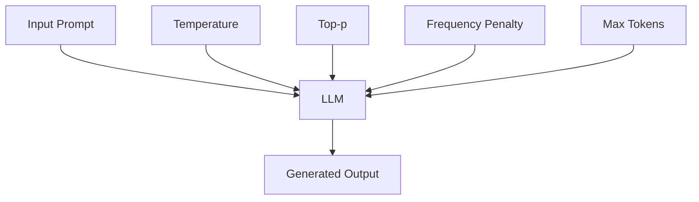

# 🔄 Module 7: Multi-Model Support

## 📋 Prerequisites
Before starting this module, you should:
- ✅ Understand basic chatbot functionality from previous modules
- ✅ Have experience with Flask API development (Module 3)
- ✅ Be familiar with Streamlit UI development (Module 5)
- ✅ Understand memory and context management (Module 6)
- ✅ Have a working Groq API key and Python environment set up

## 🎯 Learning Objectives
By the end of this module, you will be able to:
- 🧠 Implement support for multiple LLM models in your chatbot application
- 🎛️ Create UI controls for model selection and parameter tuning
- 📊 Build a model comparison system to evaluate different models
- 📈 Implement performance metrics tracking and visualization
- 🔍 Understand the impact of different parameters on model outputs

## 👋 Introduction
As the field of AI and large language models evolves rapidly, new models with different capabilities, strengths, and trade-offs are constantly being released. A truly versatile chatbot application should be able to leverage multiple models, allowing users to select the most appropriate one for their specific needs.

In this module, we'll expand our chatbot application to support multiple models from Groq's API. We'll create an interface that allows users to switch between models, adjust generation parameters, and even compare the performance and outputs of different models side by side. This flexibility will make our application more powerful and adaptable to different use cases.

## 🧠 Key Concepts

### 🔍 Model Selection and Switching
Different language models have unique strengths, weaknesses, and capabilities. Some excel at creative writing, others at factual responses, and others at code generation. By supporting multiple models, we can create a more versatile application that can be tailored to specific use cases.



The ability to switch between models allows users to:
- 🔄 Compare outputs from different models
- 🎯 Select models optimized for specific tasks
- 💰 Balance performance vs. cost considerations
- 🧪 Experiment with cutting-edge models as they're released

### 🔍 Parameter Tuning
Language models offer various parameters that control their generation behavior. Understanding and exposing these parameters gives users fine-grained control over the model outputs.

<details>
<summary>📝 Key LLM Parameters</summary>

| Parameter | Description | Typical Range | Effect |
|-----------|-------------|---------------|--------|
| Temperature | Controls randomness | 0.0 - 2.0 | Higher values increase creativity but may reduce factual accuracy |
| Top-p (nucleus sampling) | Controls diversity | 0.0 - 1.0 | Lower values make outputs more focused and deterministic |
| Frequency penalty | Reduces repetition | 0.0 - 2.0 | Higher values discourage the model from repeating the same content |
| Max tokens | Controls response length | 1 - model max | Limits the length of the generated response |

</details>

These parameters allow for fine-tuning the model's behavior:



### 🔍 Model Comparison
Comparing different models on the same prompt helps users understand the strengths and limitations of each model. This comparison can include:

- 📝 Response content and quality
- ⏱️ Response time
- 🔢 Token usage
- 💡 Creativity and diversity of outputs
- 📚 Factual accuracy and reasoning

## 🛠️ Step-by-Step Implementation

### ✨ Step 1: Setting Up Multi-Model Support in the Backend

First, we need to modify our Flask API to support multiple models and parameter configurations:

```pseudocode
FUNCTION initialize_models():
    models_list = fetch_available_models_from_groq()
    
    FOR each model in models_list:
        Store model metadata (name, context length, strengths)
        Initialize default parameters for the model
    
    RETURN models_list

FUNCTION change_model(session_id, new_model):
    IF session_id exists in active_sessions:
        Update session model to new_model
        Reset parameters to defaults for new_model
        RETURN success
    ELSE:
        RETURN error
```

### ✨ Step 2: Creating the Model Selection UI

Next, we'll implement the UI components for model selection in Streamlit:

```pseudocode
FUNCTION create_model_selection_ui():
    # Fetch available models from API
    models = fetch_models_from_api()
    
    # Create sidebar with model selector
    selected_model = sidebar.selectbox("Select Model", models)
    
    # Display model information
    Display context length, strengths, and other metadata
    
    # Handle model change
    IF selected_model changed:
        Send model change request to API
        Update session state
        Refresh parameter controls
```

### ✨ Step 3: Implementing Parameter Tuning

We'll add UI controls for adjusting model parameters:

```pseudocode
FUNCTION create_parameter_controls():
    # Fetch parameter ranges for current model
    parameter_ranges = fetch_parameter_ranges(current_model)
    
    # Create sliders for each parameter
    FOR each parameter in parameter_ranges:
        Create slider with min, max, default values
        Add help text explaining the parameter
    
    # Add update button
    IF update_button is clicked:
        Send updated parameters to API
        Display success message
```

### ✨ Step 4: Building the Model Comparison Feature

Finally, we'll implement a comparison feature to evaluate different models:

```pseudocode
FUNCTION compare_models(prompt, models_to_compare, parameters):
    results = []
    
    FOR each model in models_to_compare:
        Start timer
        response = get_model_response(model, prompt, parameters)
        end_timer
        
        Collect metrics (response time, token count)
        Store response and metrics
        
    Display responses side by side
    Create comparison charts for metrics
    RETURN comparison results
```

## ⚠️ Common Challenges and Solutions

### 🚧 Handling Different Model Capabilities
**Challenge**: Different models may support different parameters or have different context lengths.

**Solution**: 
- Implement model-specific parameter validation
- Dynamically adjust UI controls based on the selected model
- Provide clear feedback when a parameter is not supported

### 🚧 Managing API Costs
**Challenge**: Using multiple models can increase API costs, especially during comparison.

**Solution**:
- Implement usage tracking and display token counts
- Add options to limit response lengths
- Consider caching responses for identical prompts

## 💡 Best Practices

- 🔐 Store API keys securely and never expose them in client-side code
- 🔄 Cache model information to reduce API calls
- 📊 Track and display usage metrics to help users manage costs
- 🎛️ Provide sensible default parameters for each model
- 📝 Include clear descriptions of what each parameter does
- 🧪 Allow users to save and load parameter presets for different use cases

## 📝 Summary
In this module, we've expanded our chatbot application to support multiple language models, giving users the flexibility to choose the best model for their specific needs. We've implemented UI controls for model selection and parameter tuning, and built a comparison feature to evaluate different models side by side. These enhancements make our application more versatile and powerful, capable of adapting to a wide range of use cases.

## 🏋️ Exercises
Try these exercises to reinforce your learning:

1. Add support for a new model from the Groq API that wasn't included in the original implementation.
2. Create a "model preset" feature that allows users to save and load their favorite parameter configurations.
3. Implement a blind comparison test where users can evaluate responses without knowing which model generated them.
4. Add a feature to export comparison results to a CSV file for further analysis.
5. Create a dashboard that tracks model usage and performance over time.

## 📚 Further Reading
- [Groq API Documentation](https://console.groq.com/docs/quickstart)
- [Understanding LLM Parameters](https://www.anthropic.com/index/temperature-in-language-models)
- [Streamlit Documentation on Interactive Widgets](https://docs.streamlit.io/library/api-reference/widgets)
- [Evaluating LLM Performance](https://huggingface.co/blog/evaluating-llm-performance)
- [Prompt Engineering Guide](https://www.promptingguide.ai/)

## ⏭️ Next Steps
In the next module, we'll dive into LangChain, a powerful framework for building applications with language models. We'll learn how to use LangChain's components to create more sophisticated conversation chains, implement memory systems, and work with prompt templates. This will take our chatbot to the next level, enabling more complex interactions and capabilities.
