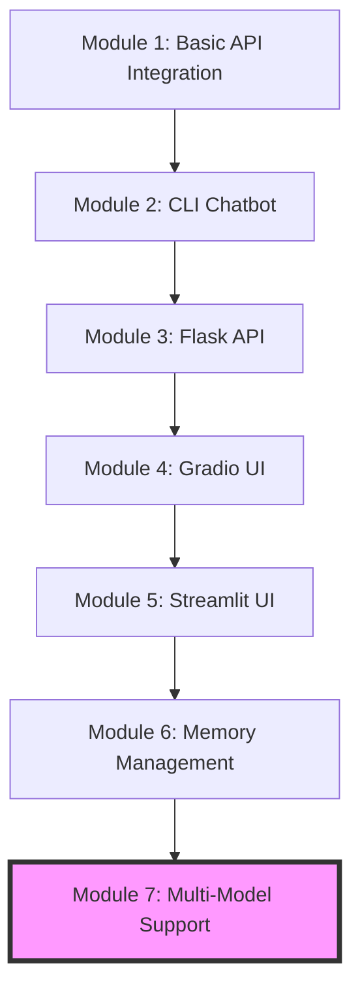
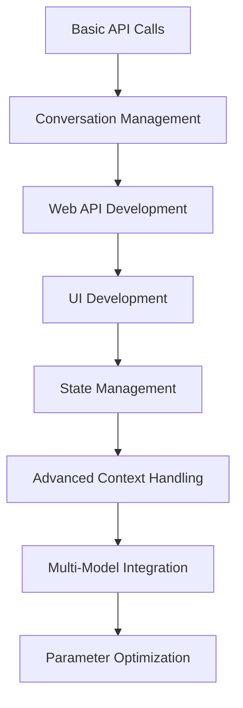

# 🤖 Building AI Chatbots with Python: Mini-Syllabus
## Modules 1-7: From Basics to Multi-Model Support

### 🚀 Introduction
- ✨ Overview of what we'll build through Module 7
- 🛠️ Prerequisites and setup
- 🌐 Understanding the landscape of LLM APIs and frameworks

## Learning Path

## Course Modules

### Part 1: Getting Started with Groq API

#### 📡 Module 1: Basic API Integration
- Setting up a Groq API account
- Understanding API keys and security best practices
- Making your first API call with Python requests
- Basic prompt engineering concepts

> **🏆 Quick Win:** By the end of this module, you'll send your first message to an AI and get a response!

#### 💬 Module 2: Building a Simple Command-Line Chatbot
- Creating a simple chat loop
- Handling user input and displaying responses
- Managing conversation context
- Adding basic error handling

> **🏆 Quick Win:** Create a functioning CLI chatbot in under 50 lines of code!

#### 🌐 Module 3: Developing a Basic Flask API
- Introduction to Flask
- Creating API endpoints for chat functionality
- Testing with Postman/cURL
- Adding basic session management

### Part 2: Building User Interfaces

#### 🎨 Module 4: Creating a Gradio UI
- Introduction to Gradio
- Setting up a basic chat interface
- Connecting to our Flask API
- Styling and customizing the UI

> **🏆 Quick Win:** Transform your chatbot into a professional-looking web app with minimal code!

#### 📊 Module 5: Creating a Streamlit Alternative
- Introduction to Streamlit
- Building a chatbot interface with Streamlit
- Adding session state management
- Customizing the UI with Streamlit components

### Part 3: Advanced Chatbot Features

#### 🧠 Module 6: Memory and Context Management
- Understanding token limitations
- Implementing conversation history
- Strategies for maintaining context
- Window-based and summary-based approaches

#### 🔄 Module 7: Multi-Model Support
- Supporting different Groq models
- Model selection in the UI
- Parameter tuning (temperature, top-p, etc.)
- Comparing model performance

## 📚 Key Technologies Covered

Click to expand the list of technologies

| Technology | Used In | Purpose |
|------------|---------|---------|
| **Python** | All modules | Primary programming language |
| **Groq API** | All modules | LLM provider for AI capabilities |
| **Requests** | Module 1-3 | Making API calls |
| **Flask** | Module 3 | Backend API development |
| **Gradio** | Module 4 | Building simple UI |
| **Streamlit** | Module 5-7 | Building advanced UI |
| **Pandas** | Module 7 | Data manipulation for metrics |
| **Plotly** | Module 7 | Data visualization |

## 🧩 Skills Progression

## 📊 Project Evolution

By Module 7, your project will have evolved from a simple API call to a sophisticated chatbot application with:

- 🌐 A Flask backend API
- 🎨 An interactive Streamlit UI
- 💾 Conversation memory and context management
- 🔄 Support for multiple AI models
- 🎛️ Parameter tuning capabilities
- 📈 Performance comparison tools

## 📝 Assessment Checkpoints

- ✅ **Module 1**: Successfully make API calls to Groq
- ✅ **Module 2**: Build a working CLI chatbot
- ✅ **Module 3**: Create a Flask API with chat endpoints
- ✅ **Module 4**: Implement a Gradio UI connected to your API
- ✅ **Module 5**: Build an enhanced Streamlit interface
- ✅ **Module 6**: Add memory management to your chatbot
- ✅ **Module 7**: Implement multi-model support and parameter tuning

## 🔮 What's Next After Module 7

After completing Module 7, you'll be ready to explore:

- ⛓️ LangChain integration for advanced capabilities
- 🛠️ Building agents with tools
- 🤗 Local model deployment with Hugging Face
- 🚀 Performance optimization
- 🌎 Production deployment options

## 📚 Recommended Resources

- [Groq API Documentation](https://console.groq.com/docs/quickstart)
- [Flask Documentation](https://flask.palletsprojects.com/)
- [Streamlit Documentation](https://docs.streamlit.io/)
- [Prompt Engineering Guide](https://www.promptingguide.ai/)
- [LLM Parameter Tuning Best Practices](https://www.anthropic.com/index/temperature-in-language-models)
