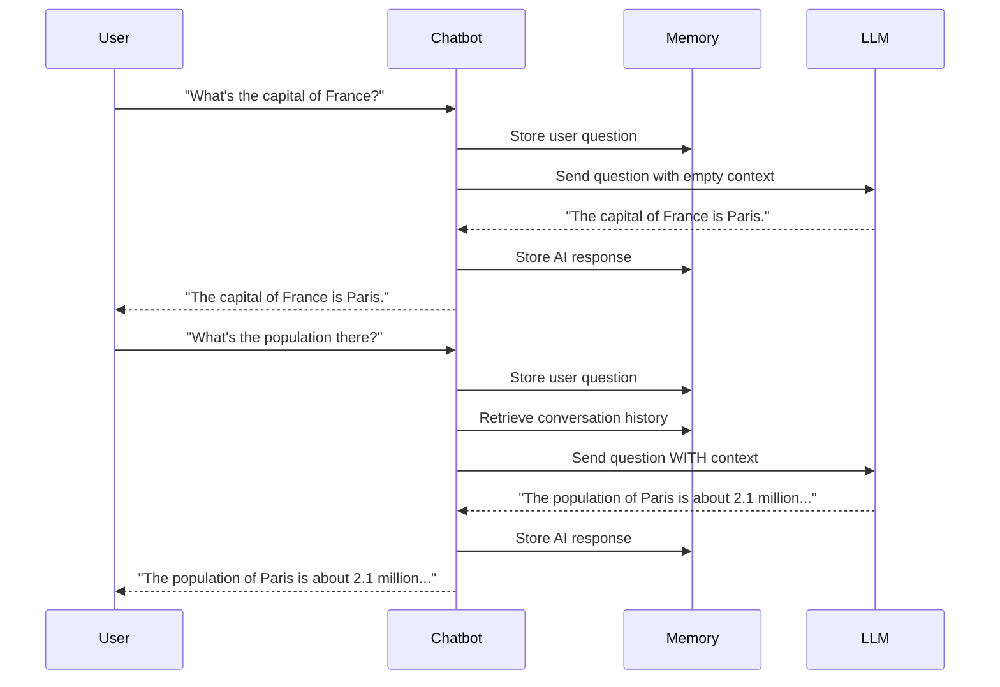

# 🚀 Module 2: Building a Simple Command-Line Chatbot

## 📋 Prerequisites
Before starting this module, you should:
- 🐍 Have completed Module 1: Basic API Integration with Groq
- 🔑 Have a Groq API key set up in your environment
- 💻 Be familiar with Python classes and object-oriented programming basics
- 🔄 Understand the concept of loops and user input in Python
- 📦 Have the `requests` and `python-dotenv` packages installed

## 🎯 Learning Objectives
By the end of this module, you will be able to:
- 🏗️ Create a class-based structure for your chatbot
- 💾 Implement conversation history to maintain context across messages
- 🔄 Build an interactive command-line interface for natural back-and-forth conversation
- 🛠️ Add special commands for managing your chatbot (clearing history, changing models)
- ⚠️ Handle errors gracefully in a conversational context

## 👋 Introduction
Welcome to Module 2 of our chatbot tutorial! In the previous module, we learned how to make basic API calls to Groq's Large Language Models. While that was a great start, it had a significant limitation: each interaction was isolated, with no memory of previous exchanges. Real conversations don't work that way—they build on what was said before.

🧠 In this module, we'll take a major step forward by creating a chatbot that can remember your conversation history. This ability to maintain context is what transforms a simple query-response system into something that feels more like a natural conversation. You'll be able to ask follow-up questions, refer to previous information, and have the AI understand what you're talking about.

⌨️ We'll also build a simple but effective command-line interface that allows for continuous interaction without restarting the program. By the end of this module, you'll have a fully functional CLI chatbot that you can have extended conversations with—all in under 100 lines of code! This foundation will serve as the building block for more advanced features in future modules.

## 🧠 Key Concepts

### 🔍 Conversation Context and Memory
One of the most powerful features of modern chatbots is their ability to maintain context throughout a conversation. Without context, every interaction would be isolated, forcing users to provide complete information with every message. With context, the chatbot can understand references to previous messages, making interactions feel more natural and human-like.



In the diagram above, notice how the second question ("What's the population there?") doesn't explicitly mention Paris. Without context, the LLM wouldn't know what "there" refers to. By including the conversation history in our API requests, the model can understand that "there" refers to Paris, the capital of France mentioned in the previous exchange.

### 🔍 Object-Oriented Design for Chatbots
For our chatbot, we'll use object-oriented programming (OOP) principles to create a clean, modular design. This approach offers several advantages:

1. **Encapsulation**: We can keep related data (like API keys and conversation history) together with the methods that use them.
2. **Reusability**: The chatbot class can be imported and used in other projects.
3. **Maintainability**: It's easier to add features or fix bugs when code is organized into logical units.
4. **State Management**: Objects naturally maintain state, which is perfect for tracking conversation history.

Our chatbot class will encapsulate:
- Configuration (API key, model selection)
- Conversation history
- Methods for sending/receiving messages
- Utility functions (clearing history, changing models)

### 🔍 Command-Line Interfaces for Chatbots
A command-line interface (CLI) provides a simple yet effective way for users to interact with our chatbot. While not as visually appealing as a graphical interface, CLIs have several advantages:

1. **Simplicity**: Easy to implement with minimal code
2. **Low Resource Usage**: Runs efficiently on any system
3. **Accessibility**: Works in environments where graphical interfaces aren't available
4. **Focus on Functionality**: Allows us to focus on core chatbot features before adding UI complexity

Our CLI will include:
- A continuous input loop for ongoing conversation
- Special commands prefixed with specific characters (e.g., `/clear` or `model:`)
- Visual cues to distinguish between user and AI messages
- Status indicators (e.g., "AI is thinking...")

## 🛠️ Step-by-Step Implementation

### ✨ Step 1: Setting Up the Chatbot Class
First, we'll create a class to encapsulate our chatbot's functionality. This class will manage the conversation history and handle communication with the Groq API.

```python
# Pseudocode for the GroqChatbot class
class GroqChatbot:
    def __init__(self, api_key, model="llama3-70b-8192"):
        # Initialize with API key and model
        # Set up conversation history with system message
        # Configure API endpoint and headers
    
    def send_message(self, message):
        # Add user message to history
        # Prepare request with full conversation history
        # Send request to API
        # Process response
        # Add AI response to history
        # Return the response
    
    def clear_history(self):
        # Reset conversation history to just system message
    
    def change_model(self, new_model):
        # Update the model used for generation
```

The key improvement over Module 1 is that we're now maintaining a conversation history list. This list will contain all messages exchanged between the user and the AI, allowing the model to reference previous parts of the conversation when generating responses.

### ✨ Step 2: Implementing the Conversation Loop
Next, we'll create a main function that sets up the chatbot and runs a continuous conversation loop:

```python
# Pseudocode for the main function
def main():
    # Initialize the chatbot with API key
    # Print welcome message and instructions
    
    # Start conversation loop
    while True:
        # Get user input
        
        # Check for special commands (exit, clear, etc.)
        
        # If not a special command, send to chatbot and get response
        
        # Display the response
```

This loop will continue until the user explicitly exits, allowing for an ongoing conversation. We'll also implement special commands that let users control the chatbot's behavior without breaking the conversation flow.

### ✨ Step 3: Adding Special Commands
To make our chatbot more user-friendly, we'll add special commands that allow users to:
- Exit the conversation
- Clear the conversation history
- View the conversation history
- Change the AI model

```python
# Pseudocode for handling special commands
if user_input.lower() == 'exit':
    # Exit the program
elif user_input.lower() == 'clear':
    # Clear conversation history
elif user_input.lower() == 'history':
    # Display conversation history
elif user_input.lower().startswith('model:'):
    # Extract model name and change the model
else:
    # Process as normal message
```

These commands give users more control over their interaction with the chatbot, enhancing the overall experience.

### ✨ Step 4: Error Handling and User Experience
Finally, we'll add robust error handling and improve the user experience:

```python
# Pseudocode for error handling and UX improvements
try:
    # Show "AI is thinking..." message
    # Get response from chatbot
    # Format and display the response nicely
except Exception as e:
    # Handle errors gracefully
    # Provide helpful error message
```

Good error handling ensures that the chatbot remains usable even when problems occur, such as network issues or API errors.

## ⚠️ Common Challenges and Solutions

### 🚧 Token Limits and Context Windows
**Challenge**: LLMs have a maximum context window (the number of tokens they can process at once). As conversations grow longer, they may exceed this limit.

**Solution**: 
- 📏 Monitor the token count of your conversation history
- 🪓 Implement a sliding window approach, removing older messages when needed
- 📝 Consider summarizing older parts of the conversation instead of removing them entirely

```python
# Pseudocode for managing token limits
if estimated_token_count > MAX_TOKENS:
    # Remove oldest messages (excluding system message)
    # Or implement more sophisticated pruning strategy
```

### 🚧 Maintaining Conversation Coherence
**Challenge**: When the AI doesn't have enough context, or when the context is managed poorly, conversations can become disjointed or confusing.

**Solution**:
- 🧩 Always include a system message that defines the AI's role
- 🔄 Preserve the most recent exchanges, which are usually the most relevant
- 📋 Consider adding a "memory refresh" command that reminds the AI of important information

## 💡 Best Practices

1. **🧠 Thoughtful System Messages**: The system message sets the tone and capabilities of your chatbot. Craft it carefully to guide the AI's behavior.

2. **⚖️ Balance History Management**: Keep enough history for context, but be mindful of token limits. Quality of context often matters more than quantity.

3. **🛡️ Graceful Error Recovery**: When errors occur, provide clear information to the user and ensure the conversation can continue.

4. **🔍 Clear Command Syntax**: If implementing special commands, make them intuitive and provide help documentation.

5. **💬 Conversation Feedback**: Give users visual cues about what's happening (e.g., "AI is thinking...") to improve the experience.

6. **🔄 Stateful Design**: Design your chatbot class to maintain state properly, making it easier to extend functionality later.

## 📝 Summary
In this module, we've transformed our basic API integration into a fully functional conversational chatbot. By implementing conversation history, we've given our chatbot memory, allowing it to understand context and provide more relevant responses. We've also created a simple but effective command-line interface that enables natural back-and-forth conversation.

The key improvements we've made include:
- 🏗️ Creating a well-structured chatbot class
- 💾 Implementing conversation history management
- 🔄 Building an interactive command loop
- 🛠️ Adding special commands for enhanced control
- ⚠️ Implementing robust error handling

These foundations will serve us well as we continue to enhance our chatbot in future modules. You now have a functional chatbot that you can have real conversations with—a significant step toward building more advanced AI applications! 🎉

## 🏋️ Exercises
Try these exercises to reinforce your learning:

1. **🔧 Custom System Message**: Modify the chatbot to allow users to set a custom system message, changing the AI's persona or role.

2. **📊 Token Counter**: Implement a simple token counting function to estimate the size of your conversation history and warn users when approaching limits.

3. **📝 Conversation Export**: Add a feature to export the conversation history to a text file for later reference.

4. **🎭 Multiple Personas**: Extend the chatbot to support switching between different predefined personas (e.g., helpful assistant, creative writer, technical expert).

5. **🔍 Message Search**: Implement a command that allows users to search through the conversation history for specific terms or exchanges.

## 📚 Further Reading
- 📖 [OpenAI Chat Completions Guide](https://platform.openai.com/docs/guides/chat) - While for a different API, the concepts apply broadly
- 🧠 [Conversation Design Principles](https://developers.google.com/assistant/conversation-design/learn-about-conversation-design)
- 🐍 [Python Classes Documentation](https://docs.python.org/3/tutorial/classes.html)
- 📊 [Token Usage Optimization Strategies](https://www.promptingguide.ai/token_usage)

## ⏭️ Next Steps
In Module 3, we'll take our chatbot to the web by developing a Flask API. This will allow our chatbot to be accessed via HTTP requests, opening up possibilities for integration with web applications, mobile apps, and other services. We'll learn how to create API endpoints, manage sessions for multiple users, and handle requests and responses in a web context. Get ready to make your chatbot accessible to the world! 🌐
