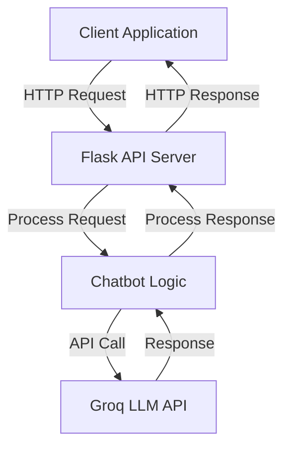
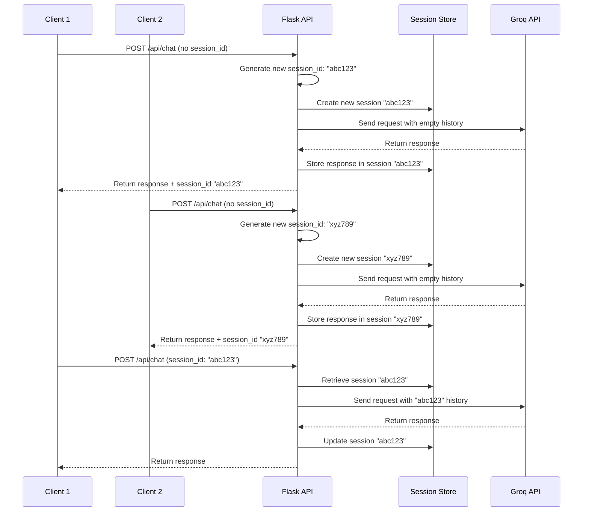

# 🚀 Module 3: Developing a Basic Flask API

## 📋 Prerequisites
Before starting this module, you should:
- 🐍 Have completed Module 2: Building a Simple Command-Line Chatbot
- 🔑 Have a Groq API key set up in your environment
- 💻 Understand basic Python functions and error handling
- 🌐 Have a basic understanding of HTTP requests and responses
- 📦 Have the `requests`, `python-dotenv`, and `flask` packages installed

## 🎯 Learning Objectives
By the end of this module, you will be able to:
- 🏗️ Create a Flask web server with API endpoints
- 🔌 Implement RESTful API principles for chatbot interactions
- 🧩 Design a session management system for multiple users
- 🔄 Handle HTTP requests and responses properly
- 🛡️ Implement error handling for API endpoints
- 🧪 Test API endpoints using tools like Postman or cURL

## 👋 Introduction
Welcome to Module 3 of our chatbot tutorial! In the previous modules, we built a command-line chatbot that can maintain conversation context. While this is great for personal use, what if you want to integrate your chatbot into a website, mobile app, or other services? This is where web APIs come in!

🌐 In this module, we'll transform our chatbot into a web service by creating a Flask API. This will allow any application to interact with our chatbot through standard HTTP requests. Instead of being limited to the command line, your chatbot will become accessible to a wide range of applications and users across the internet.

🔌 APIs (Application Programming Interfaces) are the backbone of modern web applications, allowing different software systems to communicate with each other. By exposing our chatbot as an API, we're making it more versatile and ready for integration into larger systems. This is a crucial step toward building professional-grade AI applications!

## 🧠 Key Concepts

### 🔍 Web APIs and RESTful Design
Web APIs allow different software applications to communicate over the internet using standard HTTP protocols. REST (Representational State Transfer) is a popular architectural style for designing networked applications. RESTful APIs use HTTP requests to perform CRUD operations (Create, Read, Update, Delete) on resources.

Key principles of RESTful APIs include:

1. **Client-Server Architecture**: Separation of concerns between the client (which requests resources) and the server (which provides resources)
2. **Statelessness**: Each request contains all the information needed to complete it
3. **Resource-Based**: APIs are organized around resources (like "chat" or "session")
4. **Standard HTTP Methods**: Using GET, POST, PUT, DELETE for different operations
5. **Standard Status Codes**: Using HTTP status codes (200 OK, 404 Not Found, etc.) to indicate outcomes

For our chatbot API, we'll create endpoints that follow these principles, making our API intuitive and easy to use.



### 🔍 Flask Web Framework
Flask is a lightweight web framework for Python that allows us to quickly build web applications and APIs. It's perfect for our chatbot API because it's:

1. **Simple and Minimalist**: Easy to learn and implement
2. **Flexible**: Doesn't force a particular project structure
3. **Extensible**: Can be enhanced with various extensions
4. **Well-Documented**: Has excellent documentation and community support

With just a few lines of code, Flask lets us define routes (URL patterns) and the functions that should handle requests to those routes. For example, we can create a `/api/chat` endpoint that processes chat messages and returns AI responses.

### 🔍 Session Management
In our command-line chatbot, we maintained a single conversation history. But a web API might serve multiple users simultaneously, each with their own conversation. We need a way to keep these conversations separate.

Session management allows us to:
1. **Identify Users**: Track who is making each request
2. **Maintain Context**: Keep separate conversation histories for each user
3. **Manage Resources**: Clean up inactive sessions to save memory

We'll implement session management using unique session IDs. When a user first connects, they'll receive a session ID that they must include in subsequent requests. This allows us to retrieve the correct conversation history for each user.



## 🛠️ Step-by-Step Implementation

### ✨ Step 1: Setting Up Flask
First, we need to set up our Flask application and configure it properly:

```
# PSEUDOCODE: Setting up Flask application
1. Import necessary libraries (Flask, request handling, CORS support)
2. Load environment variables from .env file
3. Get API key from environment variables
4. If API key is missing:
   - Raise an error to prevent starting without authentication
5. Initialize the Flask application
6. Enable CORS to allow requests from different origins
7. Create an empty dictionary to store conversations by session ID
```

We're using Flask to create our web server and CORS (Cross-Origin Resource Sharing) to allow requests from different domains. We also set up a dictionary to store conversations for different sessions.

### ✨ Step 2: Creating the Chat Endpoint
Next, we'll create our main endpoint for handling chat messages:

```
# PSEUDOCODE: Chat endpoint logic
1. Define a route for '/api/chat' that accepts POST requests
2. Extract data from the incoming JSON request
3. Get the user's message and session ID from the request
4. If no session ID was provided:
   - Generate a new unique session ID
5. If this is a new session (not in our conversations dictionary):
   - Initialize a new conversation with a system message
6. Add the user's message to the conversation history
7. Send the entire conversation history to the LLM API
8. Extract the AI's response from the API result
9. Add the AI's response to the conversation history
10. Return a JSON response containing:
    - The AI's response text
    - The session ID (for future requests)
```

This endpoint:
1. Receives a message and optional session ID
2. Creates a new session if needed
3. Retrieves or initializes the conversation history
4. Adds the user's message to the history
5. Sends the entire conversation to the Groq API
6. Adds the AI's response to the history
7. Returns the response along with the session ID

### ✨ Step 3: Adding Utility Endpoints
To make our API more useful, we'll add endpoints for managing sessions and clearing conversation history:

```
# PSEUDOCODE: Utility endpoints

# Clear conversation endpoint
1. Define a route for '/api/clear' that accepts POST requests
2. Extract the session ID from the request data
3. If the session exists in our conversations dictionary:
   - Reset it to only contain the initial system message
4. Return a success response

# Models endpoint
1. Define a route for '/api/models' that accepts GET requests
2. Create a list of available models with their IDs and names
3. Return the list as a JSON response

# Sessions endpoint
1. Define a route for '/api/sessions' that accepts GET requests
2. Create an empty list to store session information
3. For each session in our conversations dictionary:
   - Count the number of messages (excluding system message)
   - Add the session ID and message count to our list
4. Return the list as a JSON response
```

These endpoints allow clients to:
1. Clear the conversation history for a session
2. Get a list of available AI models
3. Get information about active sessions

### ✨ Step 4: Running the Server
Finally, we'll add code to run our Flask server:

```
# PSEUDOCODE: Running the server
1. Check if this file is being run directly (not imported)
2. Get the port number from environment variables (default to 5000)
3. Print a startup message with the port number
4. Start the Flask server:
   - Listen on all network interfaces (0.0.0.0)
   - Use the specified port
   - Enable debug mode for development
```

This starts the server on port 5000 (or another port specified in the environment) and makes it accessible to all network interfaces.

## ⚠️ Common Challenges and Solutions

### 🚧 Handling CORS Issues
**Challenge**: When your API and client are on different domains, browsers may block requests due to CORS policies.

**Solution**:
- 🔄 Use the Flask-CORS extension to enable cross-origin requests
- 🛡️ Configure CORS with appropriate settings for your use case
- 🔒 Consider security implications and restrict origins if needed

```
# PSEUDOCODE: Configuring CORS

# For development (allow all origins)
1. Import CORS functionality
2. Apply CORS to the entire application with default settings

# For production (restrict to specific origins)
1. Import CORS functionality
2. Apply CORS to the application with restrictions:
   - Only allow specific routes (e.g., /api/*)
   - Only allow specific origins (e.g., your website domain)
```

### 🚧 Managing Server Resources
**Challenge**: As more users interact with your API, server resources like memory can become strained, especially if you store conversation histories indefinitely.

**Solution**:
- ⏱️ Implement session timeouts to clear inactive conversations
- 🧹 Add a cleanup routine that runs periodically
- 📊 Monitor resource usage and implement limits if needed

```
# PSEUDOCODE: Session cleanup process
1. Create a function to clean up inactive sessions
2. Get the current timestamp
3. Loop through all session IDs in our conversations dictionary:
   - Calculate how long the session has been inactive
   - If the inactivity period exceeds our timeout threshold:
     * Remove the session from the conversations dictionary
     * Remove the session from the last activity tracker
4. Schedule this function to run periodically
```

## 💡 Best Practices

1. **📝 Clear Documentation**: Document your API endpoints, expected request formats, and possible responses. This makes it easier for others to use your API.

2. **🔒 Security First**: Protect sensitive information like API keys. Consider implementing authentication for your API if it will be publicly accessible.

3. **⚠️ Comprehensive Error Handling**: Return appropriate HTTP status codes and error messages when things go wrong. This helps clients understand and respond to issues.

4. **🧪 Test Thoroughly**: Test your API with different inputs, including edge cases and invalid data. Tools like Postman or cURL are invaluable for API testing.

5. **📊 Logging and Monitoring**: Implement logging to track API usage and errors. This helps with debugging and understanding how your API is being used.

6. **⚖️ Rate Limiting**: Consider implementing rate limiting to prevent abuse and ensure fair resource allocation among users.

## 📝 Summary
In this module, we've transformed our command-line chatbot into a web service by creating a Flask API. We've implemented endpoints for sending messages, managing sessions, and retrieving information about models and active conversations. We've also addressed common challenges like CORS issues and resource management.

Key accomplishments:
- 🏗️ Created a Flask web server with RESTful API endpoints
- 🧩 Implemented session management for multiple users
- 🔄 Handled HTTP requests and responses properly
- 🛡️ Added error handling for API endpoints
- 🌐 Made our chatbot accessible over the internet

This API serves as a foundation for more advanced applications. In future modules, we'll build user interfaces that connect to this API, allowing for more intuitive interactions with our chatbot.

## 🏋️ Exercises
Try these exercises to reinforce your learning:

1. **🔐 Add Authentication**: Implement a simple authentication mechanism (like API keys) to secure your endpoints.

2. **📊 Add Usage Metrics**: Create an endpoint that returns statistics about API usage, such as the number of requests processed or average response time.

3. **⏱️ Implement Session Timeouts**: Add functionality to automatically clean up inactive sessions after a certain period.

4. **🔄 Add Streaming Responses**: Modify the chat endpoint to support streaming responses, where tokens are sent to the client as they're generated.

5. **🧪 Create a Test Suite**: Write automated tests for your API endpoints using a tool like `pytest`.

## 📚 Further Reading
- 📖 [Flask Documentation](https://flask.palletsprojects.com/)
- 🌐 [RESTful API Design Best Practices](https://restfulapi.net/)
- 🔒 [Web API Security Best Practices](https://owasp.org/www-project-api-security/)
- 🧪 [API Testing Strategies](https://www.guru99.com/api-testing.html)
- 📊 [Monitoring Flask Applications](https://flask.palletsprojects.com/en/2.0.x/logging/)

## ⏭️ Next Steps
In Module 4, we'll build a user-friendly web interface for our chatbot using Gradio. This will allow users to interact with our chatbot through a graphical interface rather than API calls. We'll connect this interface to the Flask API we've built in this module, creating a complete web application. Get ready to give your chatbot a face! 🎨
