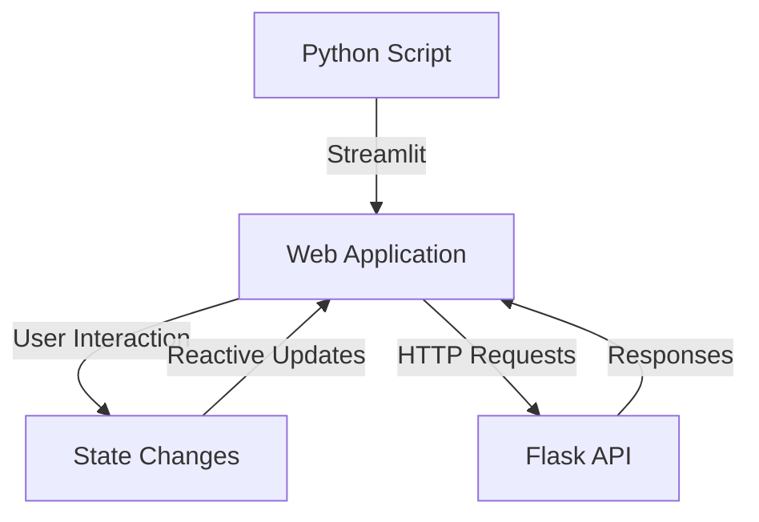
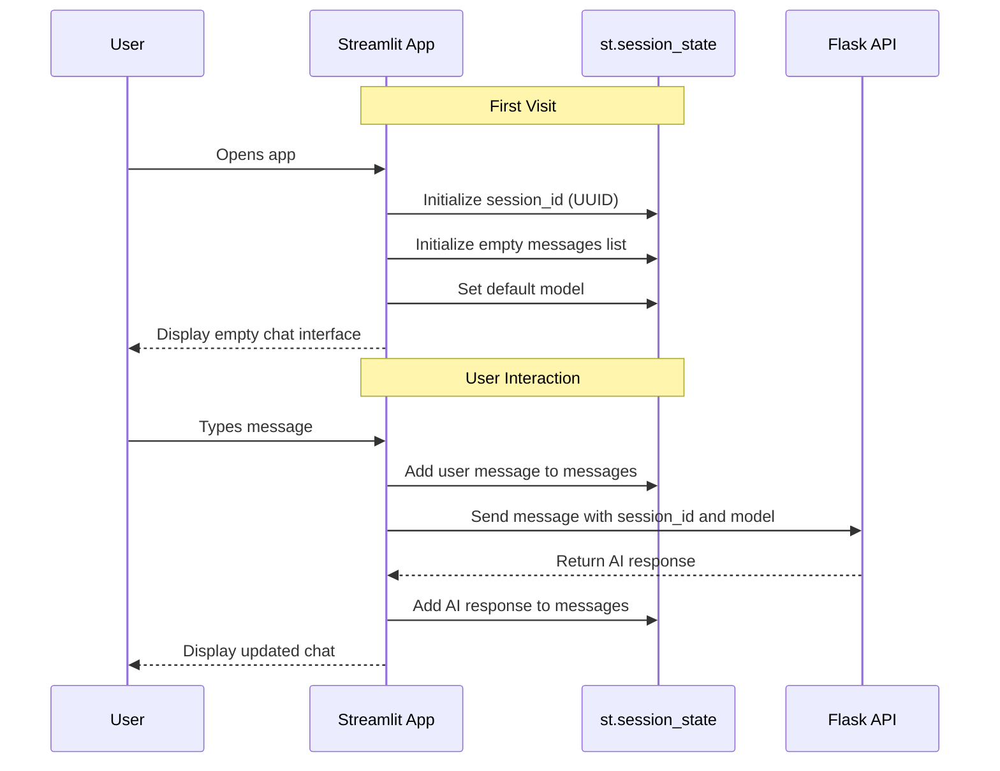

# 🚀 Module 5: Building an Advanced UI with Streamlit

## 📋 Prerequisites

Before starting this module, you should:

- 🌐 Have completed Module 4: Building a Web Interface with Gradio
- 🔌 Have a working Flask API for your chatbot
- 💻 Understand basic Python programming concepts
- 🧩 Have experience with web interfaces and APIs
- 📦 Have the `streamlit` package installed (`pip install streamlit`)
- 🔑 Understand how to use environment variables and `.env` files

## 🎯 Learning Objectives

By the end of this module, you will be able to:

- 🎨 Create a professional-grade chatbot interface using Streamlit
- 🔄 Implement advanced features like session management and model selection
- 🧩 Organize your Streamlit code using best practices
- 📱 Create a responsive design that works across devices
- 🚀 Deploy your Streamlit application to share with others
- 🛠️ Debug and troubleshoot common Streamlit integration issues

## 👋 Introduction

Welcome to Module 5 of our chatbot tutorial series! In Module 4, we explored building a chatbot interface using Gradio. While Gradio offers a quick way to create interfaces, Streamlit provides more flexibility and customization options for creating professional-grade applications.

🌟 Streamlit is a powerful Python library that turns data scripts into shareable web apps in minutes. It's particularly well-suited for data science and machine learning applications, making it perfect for our AI chatbot interface.

🔌 In this module, we'll build upon our existing Flask API to create a polished, feature-rich chatbot interface with Streamlit. We'll implement advanced features like session management, model selection, and responsive design to create a truly professional application.

💡 By the end of this module, you'll have a complete chatbot application with a stunning interface that you can deploy and share with the world!

## 🧠 Key Concepts

### 🔍 Streamlit Framework Overview

Streamlit is a Python framework that makes it easy to create interactive web applications. Here's what makes it special:

1. **Python-First**: Build entire applications using only Python
2. **Reactive**: Components automatically update when their inputs change
3. **Widget-Rich**: Includes buttons, sliders, dropdowns, and more
4. **Stateful**: Maintains state between reruns
5. **Layout Control**: Flexible layouts with columns, containers, and sidebars



Streamlit follows a unique execution model:

- The entire script runs from top to bottom when any interaction happens
- State is preserved using session state variables
- Widgets trigger reruns of the script
- Caching can be used to prevent expensive recomputations

### 🔍 Session Management in Streamlit

Session management is crucial for chatbots to maintain conversation context across interactions. Streamlit provides a built-in session state mechanism that we'll use to:

1. **Generate and Store Session IDs**: Create unique identifiers for each user session
2. **Persist Conversation History**: Store messages between reruns
3. **Maintain API Connection State**: Keep track of backend session information
4. **Handle User Preferences**: Store user settings like selected model or theme



### 🔍 API Integration Patterns

Our Streamlit interface needs to communicate with our Flask API. We'll implement several integration patterns:

1. **RESTful Communication**: Using HTTP requests to exchange data
2. **Error Handling**: Gracefully handling API errors and timeouts
3. **Asynchronous Operations**: Showing loading states during API calls
4. **State Synchronization**: Keeping frontend and backend state in sync
5. **Session Management**: Passing session information between systems

These patterns ensure robust communication between our Streamlit interface and Flask API, creating a seamless user experience.

## 🛠️ Step-by-Step Implementation

### ✨ Step 1: Setting Up the Streamlit Environment

First, we need to set up our development environment and create the basic structure of our Streamlit app:

```
# PSEUDOCODE: Setting up the Streamlit environment
1. Import necessary libraries:
   - streamlit for UI components
   - requests for API communication
   - uuid for generating session IDs
   - dotenv for environment variables
   - os for accessing environment variables

2. Load environment variables from .env file

3. Define API URL from environment or use default (localhost:5000)

4. Configure page settings:
   - Set page title
   - Set page icon
   - Set layout width
   
5. Initialize session state variables:
   - session_id: Generate unique ID if not present
   - messages: Create empty list if not present
   - model: Set default model if not present
```

This foundation sets up our environment and initializes the essential state variables our application will need.

### ✨ Step 2: Creating API Communication Functions

Now, we'll create functions to communicate with our Flask API:

```
# PSEUDOCODE: API communication functions

# Function to fetch available models
1. Define a function that takes no parameters
2. Try to:
   - Send GET request to the API's models endpoint
   - Parse the JSON response
   - Format models as a dictionary for Streamlit selectbox
3. Handle exceptions by:
   - Displaying error message
   - Returning fallback model dictionary

# Function to send chat messages
1. Define a function that takes a message parameter
2. Try to:
   - Prepare request data (message, session_id, model)
   - Show spinner while waiting for response
   - Send POST request to API's chat endpoint
   - Parse JSON response and extract AI response
3. Handle exceptions by:
   - Returning error message

# Function to clear conversation
1. Define a function that takes no parameters
2. Try to:
   - Prepare request data (session_id)
   - Send POST request to API's clear endpoint
   - Clear local message history in session state
3. Handle exceptions by:
   - Displaying error message
```

These functions handle all the communication with our Flask API, sending messages, fetching models, and clearing conversations.

### ✨ Step 3: Building the UI Components

Now we'll create the user interface components for our chatbot:

```
# PSEUDOCODE: Building UI components

# Main function
1. Create app header with title

2. Create sidebar:
   - Add title to sidebar
   - Fetch available models
   - Create model selection dropdown
   - Add clear conversation button
   - Add divider
   - Display session ID as caption

3. Create chat display:
   - Loop through messages in session state
   - For each message:
     - Create chat message component with appropriate role
     - Display message content

4. Create chat input:
   - Add chat input component
   - When user submits message:
     - Add user message to chat display
     - Add user message to session state
     - Get AI response from API
     - Display AI response
     - Add AI response to session state
```

This creates a clean, intuitive interface with a sidebar for settings, a main area for chat messages, and an input field for user messages.

### ✨ Step 4: Adding Advanced Features

Let's enhance our chatbot with advanced features:

```
# PSEUDOCODE: Adding advanced features

# Model change handler
1. Define function that runs when model is changed
2. Get model ID from selected model name
3. Update model in session state

# Implement conversation export
1. Create button to export conversation
2. When clicked:
   - Format messages as text or JSON
   - Create download button

# Add theme toggle
1. Create theme selection in sidebar
2. Use custom CSS to apply selected theme

# Implement typing animation
1. Create function to simulate typing
2. Apply to AI responses for more natural feeling
```

These advanced features enhance the user experience, making our chatbot more engaging and useful.

## ⚠️ Common Challenges and Solutions

### 🚧 Handling Streamlit's Execution Model

**Challenge**: Streamlit's execution model runs the entire script on each interaction, which can cause unexpected behavior.

**Solution**:

- 🔒 Use session state to preserve variables between reruns
- 🚫 Avoid putting API calls outside of functions or callbacks
- 🔄 Use st.cache for expensive operations
- 🧩 Structure code to account for the top-to-bottom execution flow

```
# PSEUDOCODE: Managing Streamlit's execution flow
1. Structure your code to run initialization logic only once:
   if "initialized" not in st.session_state:
       # Do first-time setup
       st.session_state.initialized = True

2. Use callback functions for user interactions:
   st.button("Clear Chat", on_click=clear_conversation)

3. Cache expensive operations:
   @st.cache_data(ttl=600)  # Cache for 10 minutes
   def fetch_models():
       # API call to get models
```

### 🚧 Managing Long Conversations

**Challenge**: Long conversations can make the interface slow and consume a lot of memory.

**Solution**:

- 📜 Implement pagination for message history
- 🗑️ Add auto-pruning of very old messages
- 💾 Implement conversation saving and loading
- 🔄 Use efficient data structures for message storage

```
# PSEUDOCODE: Efficient conversation management
1. Limit displayed messages:
   # Only show last 50 messages
   displayed_messages = st.session_state.messages[-50:]
   
2. Add pagination:
   # Split messages into pages of 10
   page = st.sidebar.number_input("Page", min_value=1, 
                                max_value=max_pages)
   
3. Implement conversation saving:
   if st.sidebar.button("Save Conversation"):
       # Generate filename with timestamp
       # Write messages to file
       # Provide download link
```

## 💡 Best Practices

1. **🏗️ Modular Code Structure**: Organize your Streamlit app into functions with clear responsibilities to improve maintainability.
    
2. **🔒 Secure Environment Variables**: Never hardcode API keys or sensitive information; use environment variables instead.
    
3. **⚡ Performance Optimization**: Use st.cache and st.cache_data decorators to prevent redundant computations and API calls.
    
4. **🎨 Consistent Visual Design**: Maintain consistent colors, fonts, and spacing throughout your interface.
    
5. **📱 Mobile Responsiveness**: Test your interface on different screen sizes and optimize layouts for mobile devices.
    
6. **⏱️ Loading States**: Always provide visual feedback during API calls and long-running operations.
    
7. **🛡️ Error Boundaries**: Implement error handling at multiple levels to prevent crashes and provide helpful error messages.
    

## 📝 Summary

In this module, we've created an advanced chatbot interface using Streamlit. We've connected it to our Flask API, implemented session management, and added features like model selection and conversation export.

Key accomplishments:

- 🎨 Created a professional-grade interface with Streamlit
- 🔄 Implemented robust session management
- 🧩 Built modular, maintainable code
- 🛠️ Added advanced features like model selection and theme toggling
- 📱 Ensured responsive design for all devices
- 🚀 Prepared our application for deployment

With these skills, you can now create sophisticated, production-ready chatbot interfaces that provide excellent user experiences!

## 🏋️ Exercises

Try these exercises to reinforce your learning:

1. **🎨 Custom Styling**: Create a custom CSS theme for your chatbot and implement a theme selector with at least three options.
    
2. **💾 Conversation Management**: Implement a system to save, name, and load multiple conversations.
    
3. **📊 Analytics Dashboard**: Add a second page to your Streamlit app that displays analytics about conversations (message count, average response time, etc.).
    
4. **🧩 Plugin System**: Create a system that allows the chatbot to use external tools or APIs based on the conversation.
    
5. **🔊 Voice Interface**: Integrate browser speech recognition and synthesis to allow voice conversations with your chatbot.
    

## 📚 Further Reading

- 📖 [Streamlit Documentation](https://docs.streamlit.io/)
- 🎨 [Effective UI Design Principles](https://www.interaction-design.org/literature/topics/ui-design-patterns)
- 🧠 [Building Production-Ready AI Interfaces](https://towardsdatascience.com/designing-a-ux-for-ai-experiences-f2c9b61e1c34)
- 🚀 [Streamlit Deployment Options](https://docs.streamlit.io/streamlit-community-cloud/get-started)
- 🔌 [Best Practices for API Integration](https://swagger.io/blog/api-development/api-design-best-practices/)

## ⏭️ Next Steps

Congratulations on completing Module 5 of our chatbot tutorial series! You now have a fully functional, production-ready chatbot interface built with Streamlit.

Here are some directions you might explore next:

- 🔌 Integrate your chatbot with external services like databases, knowledge bases, or third-party APIs
- 🧠 Implement advanced conversation features like context summarization or topic detection
- 🚀 Deploy your application to Streamlit Cloud, Heroku, or another hosting service
- 🧪 Conduct user testing and gather feedback to improve your chatbot
- 🔄 Implement continuous integration and deployment (CI/CD) for your application

Remember that building effective chatbots is an iterative process. Continue to gather feedback, make improvements, and explore new possibilities. The skills you've learned in this tutorial series provide a solid foundation for creating all kinds of AI-powered applications. Happy building! 🚀